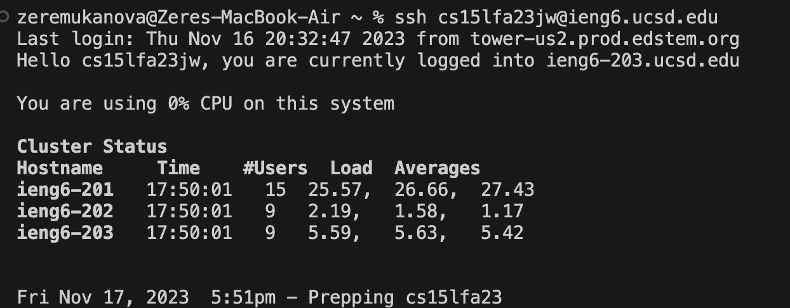
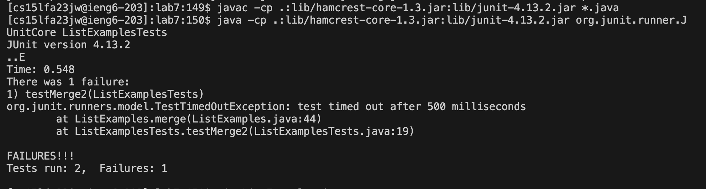
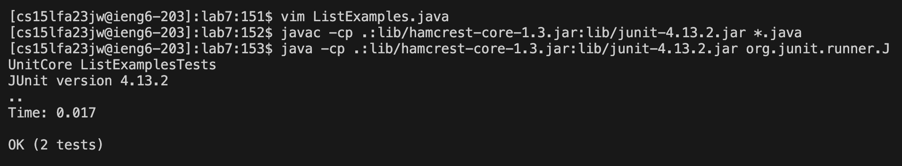
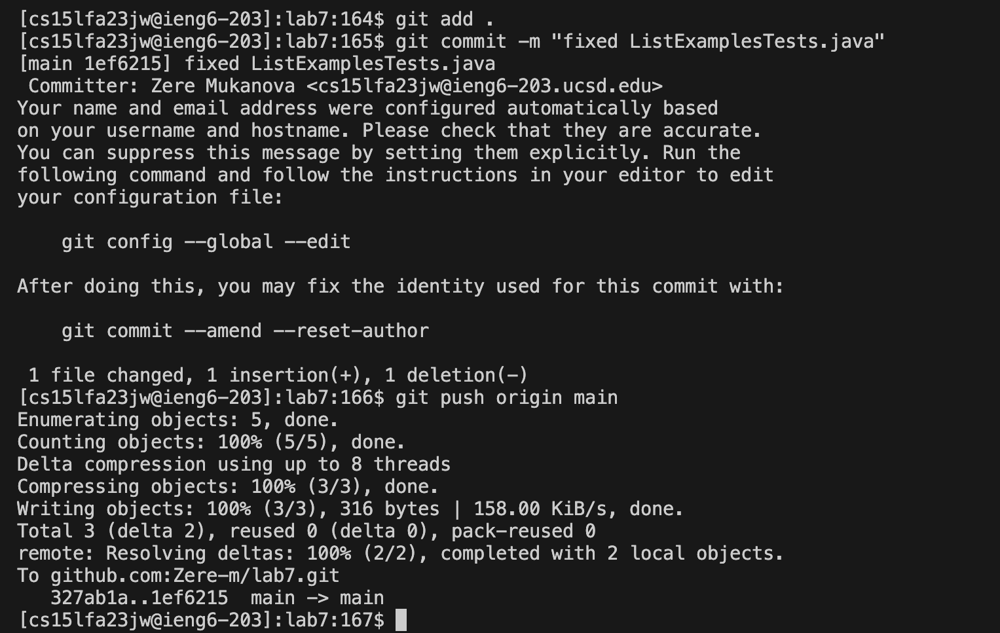

# Lab 4
**Step 4: Log into ieng6**
To log into ieng6, I typed "ssh cs15lfa23jw@ieng6.ucsd.edu" which produced this outcome: 

The exact keys pressed were: `<s><s><h><space><c><s><1><5><l><f><a><2><3><j><w><shift><@><i><e><n><g><6><.><u><c><s><d><.><e><d><u><Enter>`
This made sure I could login into my account.

**Step 5: Clone your fork of the repository from your Github account (using the SSH URL)**

To clone my fork of the repository, I first went to github and copied the SSH URL using "command-c"
I then typed "git clone" into my terminal and pasted the URL using "command-v"
The exact keys pressed in the terminal were: `<g><i><t><space><c><l><o><n><e><space><command-v><Enter>`
This downloaded the forked repository and created a directory of lab7 in my ieng6 account

**Step 6: Run the tests, demonstrating that they fail**

To run the tests, I first opened the test.sh file and copied the commands one by one
Exact keys pressed to compile: `<c><a><t><space><t><e><s><t><.><s><h><Enter>` then I selected the first line in the file `<command-c>
<command-v><Enter>`
This compiled the java files
Exact keys pressed to run: `<c><a><t><space><t><e><s><t><.><s><h><Enter> then I selected the second line in the file <command-c>
<command-v><Enter>`
This ran the tests and gave an error as an output because ListExamples.java has not been modified yet

**Step 7: Edit the code file to fix the failing test**

To edit the code file I opened it using vim and pressed the following keys:(43 down, 12 right, i, delete, 2, esc, :wq, enter)
`<down><down><down><down><down><down><down><down><down><down><down><down><down><down><down><down><down><down><down><down><down><down><down><down><down><down><down><down><down><down><down><down><down><down><down><down><down><down><down><down><down><down><down><right>`
`<right><right><right><right><right><right><right><right><right><right><right><i><delete><2><esc><:><w><q><Enter>`
The `:wq` saved the changed made to ListExamples.java

**Step 8: Run the tests, demonstrating that they now succeed**

To compile java files, I pressed the up arrow 3 times because it was in my history: `<up><up><up><Enter>`
To run the java files, I pressed the up arrow 3 times because it was in my history as well:`<up><up><up><Enter>`

**Step 9: Commit and push the resulting change to your Github account**

To stage all changes i used this command: "git add ." pressing the following keys: `<g><i><t><space><a><d><d><.><Enter>`
To add a commit message i used this command: "git commit -m "fixed ListExamplesTests.java"
To push i used this command: "git push origin main" pressing keys: `<g><i><t><space>
<u><s><h><space><o><r><i><g><i><n><space><m><a><i><n><Enter>` which pushed the changes to github

