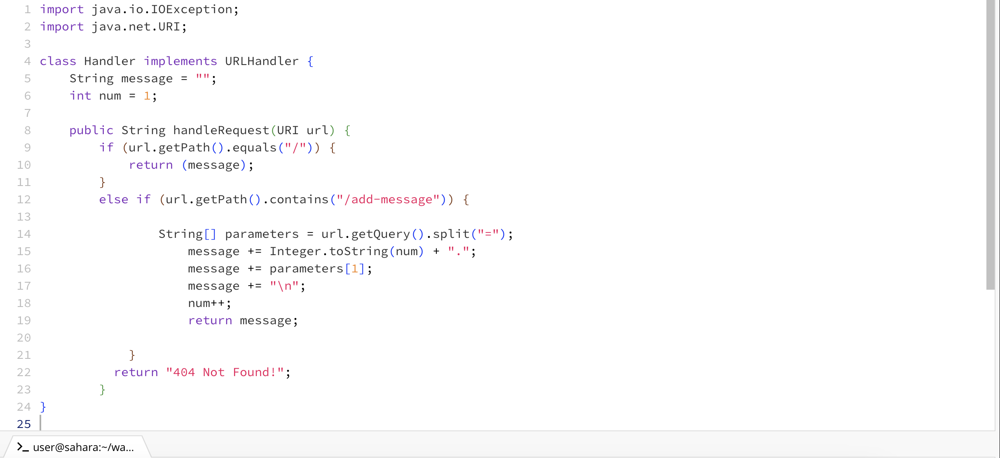
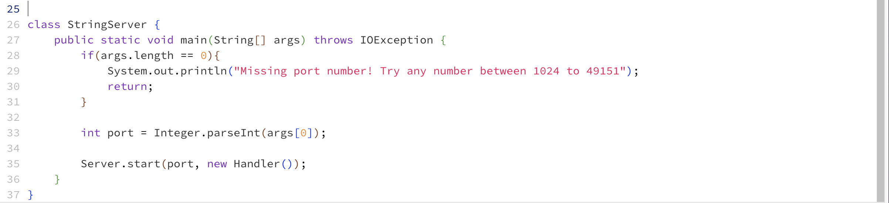
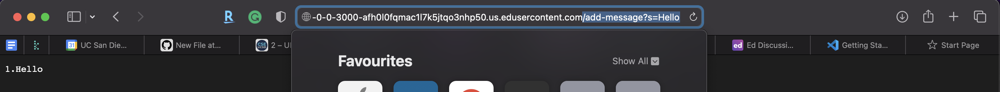
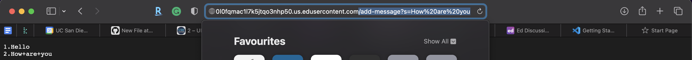
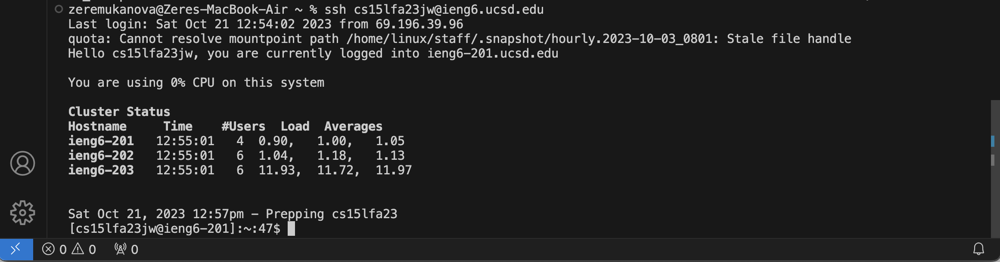

# Part 1
**String Server Code**

**Adding messages example**

* The method that is called when "/add-message?s=Hello" is added to the URL is the "handleRequest"
* A relevant argument that is passed to the method is the URU url, which holds the url for the webpage. Another two values are the string called messages as well as an integer called num. These hold the text to be shown as well as the number of lines in the text, which is important for incrementing and keeping track of lines.
* The value message is updated with "Hello" that was added after the "=" in the query followed by the '\n' character. The value num is incremented by one because one line of code was added. The text is now updated to "1. Hello \n"

* Similarly to the previous example, the method that is called when "/add-message?s=Hello" is added to the URL is the "handleRequest"
* A relevant argument that is passed to the method is the URI url, which holds the url for the webpage. Another two values are the string called messages as well as an integer called num. These hold the text to be shown as well as the number of lines in the text, which is important for incrementing and keeping track of lines.
* The value message is updated with "2.How are you \n". The value num is incremented by one because one line of code was added, it now has a value of 1. The text is now updated to "1. Hello \n 2.How+are+you \n"

# Part 2
**Public key:**

**Private key:**

**Paswordless login:**

# Part 3
In the previous two labs I learned that it is possible to edit the URL directly to access some features of the program as well as to create a server that can be programmed to have different functions. Making conditions based on the parts of the URL, for example the query or the path was also a new discovery for me, however I was able to get familiar with it due to my previous experience with Java. I wasn't aware of the process and what goes into creating a server prior to last week. 
