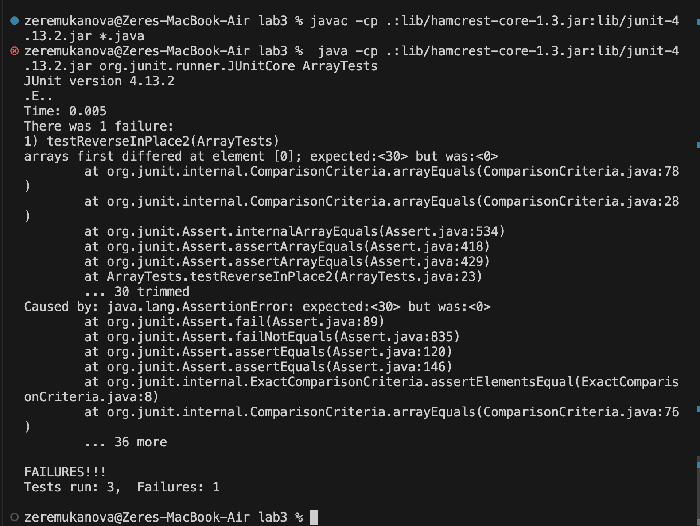

# Lab Report 3
# Part 1
* Failure inducing input: array of 3 or more characters when tring to reverse the array
```java
 @Test
  public void testReverseInPlace2(){
    int[] input = {10 ,20, 30};
    ArrayExamples.reverseInPlace(input);
    assertArrayEquals(new int[]{ 30,20,10}, ArrayExamples.reversed(input));
    System.out.println(input);
  }
```
* Successful input: array of 1 character when tring to reverse the array
```java
	@Test 
	public void testReverseInPlace() {
    int[] input1 = { 3 };
    ArrayExamples.reverseInPlace(input1);
    assertArrayEquals(new int[]{ 3 }, input1);
	}
```
**Symptom:**


*Bug fixed: 
**Original Code**
```java
static void reverseInPlace(int[] arr) {
    for(int i = 0; i < arr.length; i += 1) {
      arr[i] = arr[arr.length - i - 1];
    }
  }

  // Returns a *new* array with all the elements of the input array in reversed
  // order
  static int[] reversed(int[] arr) {
    int[] newArray = new int[arr.length];
    for(int i = 0; i < arr.length; i += 1) {
      arr[i] = newArray[arr.length - i - 1];
    }
    return arr;
  }
```
**Fixed Code**
```java
  // Changes the input array to be in reversed order
  static void reverseInPlace(int[] arr) {
    int[] temp = new int[arr.length];
    for(int i = 0; i<arr.length; i++){
      temp[i] = arr[i];
    }
    
    for(int i = 0; i < arr.length; i += 1) {
      arr[i] = temp[arr.length - i - 1];
    }
  }

  // Returns a *new* array with all the elements of the input array in reversed
  // order
  static int[] reversed(int[] arr) {
    int[] newArray = new int[arr.length];
    for(int i = 0; i < arr.length; i += 1) {
      newArray[i] = arr[arr.length - i - 1];
    }
    return newArray;
  }
```
**reverseInPlace:**
The original array was not properly reversed because the method directly modified the array without storing the original elements to reverse. The fix helped because we stores the original elements in the temporary array, so they can be referred to and put into the accurate index in our array, properly reversing it.

**reversed:**
The issue was that the newArray was never filled with elements, so it was empty. The original code kept updating the old/provided array "arr". In addition to that, the method returned the "arr" array back instead of the newArray that was supposed to be created. The fix helped because it updated the newArray, returning it when the method was done.

# Part 2
**find command**
**Using -name**

```java
[user@sahara ~/docsearch/technical]$ find -name "*10.txt"
./biomed/1471-2288-2-10.txt
./biomed/1477-7525-1-10.txt
./biomed/1472-6963-2-10.txt
./biomed/1471-2156-4-10.txt
./biomed/1471-230X-1-10.txt
./biomed/1471-2121-2-10.txt
./biomed/1471-2180-3-10.txt
./biomed/1475-4924-1-10.txt
./biomed/1471-2199-2-10.txt
./biomed/1471-2091-2-10.txt
./biomed/1471-2334-3-10.txt
./biomed/1475-2867-2-10.txt
./biomed/1472-6882-2-10.txt
./biomed/1472-6882-1-10.txt
./biomed/1471-2202-2-10.txt
./biomed/1471-2199-3-10.txt
./biomed/1477-7819-1-10.txt
./biomed/1475-925X-2-10.txt
./biomed/1475-2875-2-10.txt
./biomed/1471-2202-4-10.txt
./biomed/1468-6708-3-10.txt
./biomed/1471-2121-3-10.txt
./biomed/1471-213X-1-10.txt
./biomed/1472-6750-2-10.txt
./biomed/1471-2172-3-10.txt
./biomed/1471-2202-3-10.txt
./biomed/1471-2334-1-10.txt
./biomed/1471-2210-1-10.txt
./biomed/1471-2369-3-10.txt
./biomed/1471-2156-3-10.txt
./biomed/1471-2172-2-10.txt
./biomed/1471-2164-3-10.txt
./911report/chapter-10.txt
```
*Using the command with "*10.txt" indicates that the search that we are performing will be based on the file name(-name) and "*10.txt" specifies that the file should end in "10.txt". 
The asterisk * represents any sequence of characters, so it will accurately display all files ending with "10.txt", no matter what the preceeding characters were. This example searches 
through the directory and gives a path to all files ending with "10.txt"
This may be useful when looking for the paths to specific files because it cuts down the time of going through the directory manually

```java
[user@sahara ~/docsearch/technical]$ find -name "1477-7819-1-10.txt"
./biomed/1477-7819-1-10.txt
```
*Using the command with a specific file name, "1477-7819-1-10.txt" will search the current directory for for a file with that exact name and return a path to that file. This is case sensitive
only files that match "1477-7819-1-10.txt" exactly will be counted as found. It will not return anything if the file is not found. 
This is a more specific version of the previous example, here we are looking for a path to a specific file that has to match the name we passed exactly. This is helpful because it also cuts down time of looking for a path manually.

**Using -type**


```java
[user@sahara ~/docsearch/technical]$ find -type d
.
./biomed
./911report
```
*Using "-type d" tells find to find all the directories in the specified starting directory, which in this case is home/lab3. It returns the paths of all directories within 
the lab3 folder/directory. This could be useful while searching for directories specifically without files getting in the way.


```java
[user@sahara ~/docsearch/technical]$ find -type f -empty 
./biomed/1476-069X-1-3.txt
./biomed/1475-9268-1-1.txt
./biomed/bcr620.txt
./biomed/bcr294.txt
./biomed/1477-7827-1-23.txt
./biomed/1476-5918-1-2.txt
./biomed/ar68.txt
./biomed/1477-7525-1-10.txt
./biomed/1477-7827-1-36.txt
./biomed/1477-7827-1-13.txt
./biomed/ar118.txt
./biomed/1476-4598-2-25.txt
./biomed/bcr583.txt
./biomed/bcr303.txt
./biomed/1478-1336-1-3.txt
./biomed/1478-7954-1-3.txt
./biomed/ar120.txt
./biomed/ar79.txt
./biomed/ar778.txt
./biomed/1477-7827-1-31.txt
./biomed/1476-4598-2-1.txt
./biomed/1476-4598-1-6.txt
./biomed/bcr631.txt
./biomed/1476-069X-2-9.txt
./biomed/bcr635.txt
./biomed/1476-511X-2-2.txt
./biomed/1477-7827-1-9.txt
./biomed/1477-5956-1-1.txt
./biomed/ar93.txt
./biomed/1476-072X-2-3.txt
./biomed/1477-7827-1-43.txt
./biomed/ar149.txt
./biomed/ar328.txt
./biomed/bcr284.txt
./biomed/1476-9433-1-2.txt
./biomed/1477-7819-1-10.txt
./biomed/ar612.txt
./biomed/ar104.txt
./biomed/ar429.txt
./biomed/1475-925X-2-10.txt
./biomed/bcr285.txt
./biomed/ar130.txt
./biomed/1478-1336-1-4.txt
./biomed/1476-4598-2-3.txt
./biomed/1475-925X-2-6.txt
./biomed/bcr317.txt
./biomed/ar408.txt
./biomed/1477-7525-1-12.txt
./biomed/1476-4598-1-8.txt
./biomed/bcr458.txt
./biomed/ar140.txt
./biomed/1477-7525-1-9.txt
./biomed/ar792.txt
./biomed/1476-069X-2-4.txt
./biomed/1477-7827-1-17.txt
./biomed/1477-7827-1-21.txt
./biomed/1475-9276-1-3.txt
./biomed/ar750.txt
./biomed/1477-7827-1-46.txt
./biomed/1476-069X-2-7.txt
./biomed/1476-0711-2-7.txt
./biomed/bcr567.txt
./biomed/bcr607.txt
./biomed/ar309.txt
./biomed/1477-7827-1-6.txt
./biomed/1475-9268-1-2.txt
./biomed/1476-4598-2-22.txt
./biomed/ar430.txt
./biomed/1476-4598-2-20.txt
./biomed/ar422.txt
./biomed/ar387.txt
./biomed/ar624.txt
./biomed/1475-925X-2-12.txt
./biomed/ar745.txt
./biomed/1475-925X-2-11.txt
./biomed/1476-4598-2-24.txt
./biomed/ar615.txt
./biomed/bcr605.txt
./biomed/1476-511X-1-2.txt
./biomed/bcr602.txt
./biomed/1476-4598-1-3.txt
./biomed/bcr588.txt
./biomed/ar407.txt
./biomed/1475-925X-2-1.txt
./biomed/1476-069X-2-2.txt
./biomed/1477-7827-1-48.txt
./biomed/ar774.txt
./biomed/1477-7827-1-54.txt
./biomed/bcr618.txt
./biomed/ar331.txt
./biomed/ar601.txt
./biomed/1476-511X-2-3.txt
./biomed/1478-1336-1-2.txt
./biomed/ar319.txt
./biomed/ar795.txt
./biomed/ar799.txt
./biomed/1476-072X-2-4.txt
./biomed/bcr45.txt
./biomed/1476-4598-1-5.txt
./biomed/1476-0711-2-3.txt
./biomed/ar619.txt
./biomed/1476-4598-2-2.txt
./biomed/ar321.txt
./biomed/bcr571.txt
./biomed/1477-7827-1-27.txt
./biomed/ar383.txt
./biomed/1475-925X-2-3.txt
./biomed/bcr570.txt
./biomed/bcr273.txt
./biomed/1476-9433-1-3.txt
./biomed/bcr568.txt
./biomed/ar297.txt
./biomed/1476-4598-2-28.txt
./biomed/ar409.txt
```
*Using "-type f -empty" tells find to find all the files that are empty in the current directory(lab3). The "f" specifies to only look for regular files, not directories. Paths to all files
with no content are returned, in this case there were no empty files. This could be useful to check if any files are taking up space without storing something.

Source for above examples(-name and -type): https://www.redhat.com/sysadmin/linux-find-command 

**Using -size**

*This command searches the lab3 directory for files that are exactly 4 kilobytes in size. It can be useful to use when looking for how much space each item in the directory takes up.

```java
[user@sahara ~/docsearch/technical]$ find -size 4k
.
./911report
```
*This command searches the lab3 directory for files that have size in range: larger than 1 kilobyte & smaller than 5 kilobytes. It can be useful for looking for files in a size range to later perform tasks or delete if needed.

```java
[user@sahara ~/docsearch/technical]$ find -size +1k -size -8k
.
./biomed/1471-2490-3-2.txt
./biomed/1471-2334-3-13.txt
./911report
```


**Using -perm**
This deals with permissions, my source is this website, which explains how permissions work: https://www.grymoire.com/Unix/Permissions.html
They explain that read(4), write(2), execute(1) can all be used to intepret an octal representation of a permission.


**Example 1**
*"-perm 755" format: (owner, group, others) indicates that the owner can read+write+excute(4+2+1), the group and others can read and execute only(4+1). This command outputs all files within the directory with these specific permissions. The command is useful for checking what each user is allowed to do with it before starting a task.

```java
[user@sahara ~/docsearch/technical]$ find -type f -perm 755
./biomed/1471-2105-3-6.txt
./biomed/1476-069X-1-3.txt
./biomed/1475-9268-1-1.txt
./biomed/bcr620.txt
./biomed/1472-6882-1-12.txt
./biomed/1471-2407-3-4.txt
./biomed/bcr294.txt
./biomed/1477-7827-1-23.txt
./biomed/1476-5918-1-2.txt
./biomed/1471-2164-4-21.txt
./biomed/ar68.txt
./biomed/1471-2407-2-16.txt
./biomed/1471-2180-1-7.txt
./biomed/1471-2148-2-7.txt
./biomed/1472-6963-3-13.txt
./biomed/1471-2210-2-4.txt
./biomed/1472-6882-2-5.txt
./biomed/1471-2180-1-29.txt
./biomed/1471-230X-1-8.txt
./biomed/1471-2105-3-28.txt
./biomed/1471-2164-3-9.txt
./biomed/1471-2288-2-10.txt
./biomed/1471-2334-3-11.txt
./biomed/1471-2148-1-4.txt
./biomed/1471-2164-3-1.txt
./biomed/1472-6750-2-13.txt
./biomed/1471-2164-3-24.txt
./biomed/1471-2202-4-5.txt
./biomed/1471-2180-1-31.txt
./biomed/1471-2458-1-9.txt
./biomed/1471-5945-2-13.txt
./biomed/1472-6750-3-6.txt
./biomed/1471-2180-1-12.txt
./biomed/1477-7525-1-10.txt
./biomed/1472-6750-1-6.txt
./biomed/1472-6963-2-10.txt
./biomed/1471-2202-1-1.txt
./biomed/1471-2229-2-3.txt
./biomed/1471-2202-2-12.txt
./biomed/1471-2164-4-14.txt
./biomed/1471-2288-2-4.txt
./biomed/1471-2407-2-11.txt
./biomed/1472-6955-2-1.txt
./biomed/1471-2148-3-7.txt
./biomed/1471-2091-3-30.txt
./biomed/1471-2296-3-3.txt
./biomed/1472-6750-1-8.txt
./biomed/1471-2458-3-2.txt
./biomed/1472-6785-2-6.txt
./biomed/1471-2156-4-10.txt
./biomed/1477-7827-1-36.txt
./biomed/1471-2121-3-13.txt
./biomed/1471-2350-2-8.txt
./biomed/1471-2415-3-4.txt
./biomed/1471-2164-3-30.txt
./biomed/1471-2121-3-2.txt
./biomed/1471-2199-3-3.txt
./biomed/1471-2121-3-4.txt
./biomed/1471-2148-2-12.txt
./biomed/1471-2105-3-37.txt
./biomed/1472-6750-1-11.txt
./biomed/1471-2407-1-15.txt
./biomed/1472-6874-2-13.txt
./biomed/1471-2172-2-4.txt
./biomed/1471-2180-2-16.txt
./biomed/1471-2466-1-1.txt
./biomed/1475-2883-2-11.txt
./biomed/1471-230X-1-10.txt
./biomed/1477-7827-1-13.txt
./biomed/ar118.txt
./biomed/1472-6947-1-2.txt
./biomed/1471-2415-3-3.txt
./biomed/1471-2121-2-10.txt
./biomed/1471-2334-3-15.txt
./biomed/1471-2164-3-23.txt
./biomed/1471-213X-3-4.txt
./biomed/1472-6947-2-7.txt
./biomed/1475-4924-1-5.txt
./biomed/1475-2867-2-15.txt
./biomed/1471-2180-3-10.txt
./biomed/1471-2199-2-1.txt
./biomed/1475-2891-1-2.txt
./biomed/1471-2202-3-19.txt
./biomed/1471-2121-4-2.txt
./biomed/1476-4598-2-25.txt
./biomed/bcr583.txt
./biomed/bcr303.txt
./biomed/1472-6904-2-7.txt
./biomed/1471-2164-2-4.txt
./biomed/1471-2202-2-3.txt
./biomed/1471-2164-4-24.txt
./biomed/1471-2202-2-14.txt
./biomed/1471-2172-4-2.txt
./biomed/1471-2105-4-26.txt
./biomed/1471-2202-3-20.txt
./biomed/1471-2156-2-7.txt
./biomed/1471-2148-1-14.txt
./biomed/1471-2164-3-29.txt
./biomed/1471-2202-3-7.txt
./biomed/1472-6793-3-6.txt
./biomed/1471-230X-2-17.txt
./biomed/1478-1336-1-3.txt
./biomed/1471-2164-3-34.txt
./biomed/1471-2350-4-3.txt
./biomed/1472-6831-2-2.txt
./biomed/1471-2334-2-7.txt
./biomed/1471-2105-3-3.txt
./biomed/1471-2105-4-25.txt
./biomed/1478-7954-1-3.txt
./biomed/ar120.txt
./biomed/1475-4924-1-10.txt
./biomed/1471-2350-4-4.txt
./biomed/1471-2105-1-1.txt
./biomed/1471-2202-3-16.txt
./biomed/ar79.txt
./biomed/1471-2164-4-15.txt
./biomed/1471-2229-2-11.txt
./biomed/1471-2253-2-4.txt
./biomed/1471-2350-4-6.txt
./biomed/1471-2431-2-12.txt
./biomed/ar778.txt
./biomed/1471-2105-3-23.txt
./biomed/1477-7827-1-31.txt
./biomed/1471-2334-2-29.txt
./biomed/1471-2377-3-4.txt
./biomed/1471-2407-1-13.txt
./biomed/1471-2164-3-28.txt
./biomed/1472-6750-2-2.txt
./biomed/1471-2229-2-8.txt
./biomed/1471-2091-2-13.txt
./biomed/1472-6750-2-14.txt
./biomed/1471-2288-3-9.txt
./biomed/1471-2229-2-4.txt
./biomed/1476-4598-2-1.txt
./biomed/1471-2458-2-21.txt
./biomed/1472-6807-2-2.txt
./biomed/1476-4598-1-6.txt
./biomed/1471-2334-1-13.txt
./biomed/bcr631.txt
./biomed/1471-2431-3-5.txt
./biomed/1471-2210-2-14.txt
./biomed/1472-6769-1-1.txt
./biomed/1471-2326-2-4.txt
./biomed/1471-2180-3-11.txt
./biomed/1472-6963-1-11.txt
./biomed/1471-2091-3-15.txt
./biomed/1471-2407-2-19.txt
./biomed/1471-2334-2-5.txt
./biomed/1476-069X-2-9.txt
./biomed/1471-2091-2-16.txt
./biomed/1471-2091-2-5.txt
./biomed/1471-2199-2-10.txt
./biomed/1471-2490-3-2.txt
./biomed/1471-2121-2-15.txt
./biomed/1471-2164-4-19.txt
./biomed/1472-6807-2-3.txt
./biomed/1471-2156-2-18.txt
./biomed/1471-2407-3-14.txt
./biomed/1471-2091-2-10.txt
./biomed/1472-6807-2-5.txt
./biomed/1472-6807-3-2.txt
./biomed/1471-2458-3-11.txt
./biomed/1471-2164-4-6.txt
./biomed/1471-213X-1-12.txt
./biomed/1471-213X-1-13.txt
./biomed/1471-2334-3-10.txt
./biomed/1472-6882-3-1.txt
./biomed/1472-6785-2-7.txt
./biomed/1471-2156-2-3.txt
./biomed/1471-2121-3-18.txt
./biomed/1471-2164-3-13.txt
./biomed/1471-2202-2-7.txt
./biomed/bcr635.txt
./biomed/1471-2458-2-25.txt
./biomed/1472-6882-1-11.txt
./biomed/1471-2474-4-4.txt
./biomed/1471-2156-3-4.txt
./biomed/1472-6815-2-3.txt
./biomed/1471-2091-3-31.txt
./biomed/1471-2164-3-26.txt
./biomed/1471-2296-3-18.txt
./biomed/1471-213X-1-4.txt
./biomed/1476-511X-2-2.txt
./biomed/1472-6963-3-6.txt
./biomed/1471-2377-2-6.txt
./biomed/1472-6920-2-1.txt
./biomed/1471-213X-1-2.txt
./biomed/1472-6963-3-11.txt
./biomed/1472-684X-2-1.txt
./biomed/1471-2172-4-1.txt
./biomed/1468-6708-3-3.txt
./biomed/1471-2199-3-17.txt
./biomed/1471-2210-3-1.txt
./biomed/1477-7827-1-9.txt
./biomed/1471-2121-4-4.txt
./biomed/1471-2091-3-22.txt
./biomed/1472-6920-1-3.txt
./biomed/1471-2180-2-1.txt
./biomed/1475-2867-2-10.txt
./biomed/1471-2148-2-15.txt
./biomed/1477-5956-1-1.txt
./biomed/1471-2210-2-8.txt
./biomed/1471-2121-3-16.txt
./biomed/1471-2105-3-30.txt
./biomed/1472-6807-3-1.txt
./biomed/1472-6882-2-10.txt
./biomed/1471-2121-3-19.txt
./biomed/ar93.txt
./biomed/1472-6882-1-10.txt
./biomed/1472-6963-3-7.txt
./biomed/1476-072X-2-3.txt
./biomed/1471-2164-3-7.txt
./biomed/1471-2229-1-3.txt
./biomed/1471-2105-3-22.txt
./biomed/1471-2105-4-24.txt
./biomed/1471-2121-2-18.txt
./biomed/1471-2156-3-17.txt
./biomed/1471-2288-3-8.txt
./biomed/1471-2202-2-10.txt
./biomed/1477-7827-1-43.txt
./biomed/1472-6904-2-4.txt
./biomed/1472-6947-3-8.txt
./biomed/1471-2091-4-1.txt
./biomed/ar149.txt
./biomed/1471-2172-2-9.txt
./biomed/1471-2156-3-16.txt
./biomed/1472-6793-2-17.txt
./biomed/ar328.txt
./biomed/1471-2431-2-4.txt
./biomed/1471-2458-2-11.txt
./biomed/1471-2105-4-28.txt
./biomed/1472-6947-1-5.txt
./biomed/1471-230X-3-5.txt
./biomed/1471-2458-2-18.txt
./biomed/1471-213X-1-15.txt
./biomed/1471-2180-2-2.txt
./biomed/1471-213X-2-7.txt
./biomed/1471-2164-3-33.txt
./biomed/bcr284.txt
./biomed/1471-2199-3-10.txt
./biomed/1471-2458-3-20.txt
./biomed/1471-2253-1-1.txt
./biomed/1472-6793-1-11.txt
./biomed/1471-2466-2-3.txt
./biomed/1471-2105-3-14.txt
./biomed/1471-2121-2-11.txt
./biomed/1476-9433-1-2.txt
./biomed/1471-2121-3-11.txt
./biomed/1471-2202-2-18.txt
./biomed/1471-2148-2-8.txt
./biomed/1471-2229-2-9.txt
./biomed/1477-7819-1-10.txt
./biomed/ar612.txt
./biomed/1472-6947-2-4.txt
./biomed/1471-2172-3-9.txt
./biomed/1471-2180-2-13.txt
./biomed/1471-213X-2-8.txt
./biomed/1471-2202-2-5.txt
./biomed/1471-2105-3-2.txt
./biomed/ar104.txt
./biomed/ar429.txt
./biomed/1471-2229-3-3.txt
./biomed/1472-6793-1-8.txt
./biomed/1471-2180-1-34.txt
./biomed/1471-2148-2-2.txt
./biomed/1475-925X-2-10.txt
./biomed/1471-2261-1-6.txt
./biomed/1471-2369-3-6.txt
./biomed/1471-2164-3-32.txt
./biomed/1471-2202-2-20.txt
./biomed/1471-2407-2-18.txt
./biomed/1472-6785-1-3.txt
./biomed/1471-213X-1-6.txt
./biomed/1471-2202-2-15.txt
./biomed/1472-6963-3-12.txt
./biomed/1471-2180-1-16.txt
./biomed/1471-2466-3-1.txt
./biomed/1471-2202-3-1.txt
./biomed/1471-2091-2-7.txt
./biomed/bcr285.txt
./biomed/ar130.txt
./biomed/1471-2156-2-17.txt
./biomed/1475-2875-2-10.txt
./biomed/1471-2407-2-3.txt
./biomed/1471-2407-2-17.txt
./biomed/1471-2164-4-5.txt
./biomed/1475-2875-2-4.txt
./biomed/1471-2202-2-6.txt
./biomed/1471-2180-2-7.txt
./biomed/1471-2202-4-17.txt
./biomed/1472-6793-1-2.txt
./biomed/1478-1336-1-4.txt
./biomed/1476-4598-2-3.txt
./biomed/1471-2172-1-1.txt
./biomed/1471-2474-4-8.txt
./biomed/1475-925X-2-6.txt
./biomed/1471-2210-3-3.txt
./biomed/1471-2156-2-12.txt
./biomed/bcr317.txt
./biomed/1471-2458-2-3.txt
./biomed/ar408.txt
./biomed/1472-6963-3-1.txt
./biomed/1471-2164-4-26.txt
./biomed/1471-2407-2-8.txt
./biomed/1471-2202-3-14.txt
./biomed/1471-2164-4-16.txt
./biomed/1472-6793-2-4.txt
./biomed/1477-7525-1-12.txt
./biomed/1476-4598-1-8.txt
./biomed/1475-2875-1-14.txt
./biomed/1471-2202-2-9.txt
./biomed/1471-2202-3-5.txt
./biomed/1471-2121-2-3.txt
./biomed/1471-2172-3-4.txt
./biomed/bcr458.txt
./biomed/1471-2121-3-21.txt
./biomed/ar140.txt
./biomed/1471-2180-1-33.txt
./biomed/1471-2199-2-6.txt
./biomed/1477-7525-1-9.txt
./biomed/1472-6793-3-3.txt
./biomed/1471-2164-4-4.txt
./biomed/1472-6874-2-1.txt
./biomed/1471-2180-3-13.txt
./biomed/1472-6807-2-1.txt
./biomed/1472-6793-1-6.txt
./biomed/ar792.txt
./biomed/1471-230X-1-6.txt
./biomed/1472-6769-1-4.txt
./biomed/1471-2105-2-8.txt
./biomed/1471-2318-3-2.txt
./biomed/1471-2164-2-6.txt
./biomed/1471-2202-4-2.txt
./biomed/1476-069X-2-4.txt
./biomed/1471-2474-3-3.txt
./biomed/1471-2202-3-17.txt
./biomed/1471-5945-1-3.txt
./biomed/1477-7827-1-17.txt
./biomed/1471-2105-3-12.txt
./biomed/1471-2210-1-3.txt
./biomed/1477-7827-1-21.txt
./biomed/1475-9276-1-3.txt
./biomed/1472-6890-1-4.txt
./biomed/ar750.txt
./biomed/1471-2105-2-1.txt
./biomed/1471-2199-4-4.txt
./biomed/1471-2164-3-19.txt
./biomed/1471-2180-2-32.txt
./biomed/1471-244X-3-5.txt
./biomed/1471-244X-2-9.txt
./biomed/1477-7827-1-46.txt
./biomed/1476-069X-2-7.txt
./biomed/1471-2091-2-12.txt
./biomed/1471-2164-3-27.txt
./biomed/1476-0711-2-7.txt
./biomed/1471-2156-2-1.txt
./biomed/bcr567.txt
./biomed/1468-6708-3-7.txt
./biomed/1471-2180-1-8.txt
./biomed/bcr607.txt
./biomed/1471-2202-3-3.txt
./biomed/1471-2202-2-8.txt
./biomed/1471-2091-2-9.txt
./biomed/1475-2867-3-3.txt
./biomed/1471-2407-2-15.txt
./biomed/1471-2407-1-6.txt
./biomed/1471-2407-2-33.txt
./biomed/1471-2164-4-22.txt
./biomed/ar309.txt
./biomed/1471-2350-3-9.txt
./biomed/1471-2156-4-9.txt
./biomed/1471-2148-3-4.txt
./biomed/1472-6793-2-1.txt
./biomed/1472-684X-2-2.txt
./biomed/1471-2105-4-27.txt
./biomed/1471-2164-3-31.txt
./biomed/1472-6793-3-4.txt
./biomed/1472-6793-2-2.txt
./biomed/1471-2156-3-3.txt
./biomed/1471-2105-3-18.txt
./biomed/1471-2458-3-9.txt
./biomed/1477-7827-1-6.txt
./biomed/1475-9268-1-2.txt
./biomed/1471-2105-4-13.txt
./biomed/1471-2105-2-9.txt
./biomed/1471-2121-4-5.txt
./biomed/1471-2202-3-11.txt
./biomed/1471-2202-4-10.txt
./biomed/1476-4598-2-22.txt
./biomed/1471-2172-3-2.txt
./biomed/ar430.txt
./biomed/1471-2164-3-16.txt
./biomed/1471-2121-3-25.txt
./biomed/1471-2180-3-5.txt
./biomed/1471-2164-3-15.txt
./biomed/1468-6708-3-10.txt
./biomed/1471-2350-2-12.txt
./biomed/1476-4598-2-20.txt
./biomed/ar422.txt
./biomed/ar387.txt
./biomed/1471-2334-3-13.txt
./biomed/1471-2091-3-8.txt
./biomed/1468-6708-3-4.txt
./biomed/1471-2164-3-18.txt
./biomed/ar624.txt
./biomed/1471-2377-1-2.txt
./biomed/1475-925X-2-12.txt
./biomed/1471-2202-2-2.txt
./biomed/1471-2369-4-5.txt
./biomed/1471-2369-4-1.txt
./biomed/1471-2202-4-11.txt
./biomed/ar745.txt
./biomed/1471-2458-2-6.txt
./biomed/1471-2334-1-9.txt
./biomed/1471-2369-3-9.txt
./biomed/1472-684X-1-5.txt
./biomed/1471-2105-3-34.txt
./biomed/1471-2288-2-11.txt
./biomed/1471-2121-3-10.txt
./biomed/1471-2253-2-5.txt
./biomed/1471-2334-1-17.txt
./biomed/1475-925X-2-11.txt
./biomed/1471-2199-3-7.txt
./biomed/1476-4598-2-24.txt
./biomed/1471-230X-2-21.txt
./biomed/1471-2180-3-9.txt
./biomed/1471-2199-2-3.txt
./biomed/1471-2121-2-21.txt
./biomed/1471-2288-3-4.txt
./biomed/ar615.txt
./biomed/1471-2431-3-4.txt
./biomed/1471-2261-3-5.txt
./biomed/1471-2105-3-17.txt
./biomed/1472-6874-2-8.txt
./biomed/1471-2202-2-17.txt
./biomed/1471-2091-2-11.txt
./biomed/1471-2199-2-5.txt
./biomed/1471-2156-2-8.txt
./biomed/bcr605.txt
./biomed/1471-2350-3-12.txt
./biomed/1471-2091-3-4.txt
./biomed/1471-2407-3-15.txt
./biomed/1476-511X-1-2.txt
./biomed/1471-2474-2-2.txt
./biomed/1472-6793-1-15.txt
./biomed/1471-213X-3-2.txt
./biomed/1471-2105-3-24.txt
./biomed/1471-2202-4-3.txt
./biomed/1472-6874-3-2.txt
./biomed/bcr602.txt
./biomed/1471-2296-3-19.txt
./biomed/1476-4598-1-3.txt
./biomed/bcr588.txt
./biomed/1471-2121-2-6.txt
./biomed/1475-2832-1-1.txt
./biomed/1471-2458-2-16.txt
./biomed/1472-6807-2-9.txt
./biomed/1471-213X-1-10.txt
./biomed/1472-6793-2-16.txt
./biomed/1475-2875-2-14.txt
./biomed/1472-6882-3-3.txt
./biomed/1471-2121-1-2.txt
./biomed/1471-5945-3-3.txt
./biomed/1471-2091-3-13.txt
./biomed/1472-6890-2-5.txt
./biomed/1471-2199-2-2.txt
./biomed/1472-6750-2-10.txt
./biomed/ar407.txt
./biomed/1471-2261-3-4.txt
./biomed/1471-2458-3-5.txt
./biomed/1471-2199-4-5.txt
./biomed/1475-925X-2-1.txt
./biomed/1476-069X-2-2.txt
./biomed/1471-2210-1-8.txt
./biomed/1471-2148-3-18.txt
./biomed/1471-2121-2-12.txt
./biomed/1471-2199-2-12.txt
./biomed/1471-2091-3-17.txt
./biomed/1471-2202-4-16.txt
./biomed/1471-2172-3-10.txt
./biomed/1471-2407-2-23.txt
./biomed/1471-2202-3-10.txt
./biomed/1471-2334-2-24.txt
./biomed/1477-7827-1-48.txt
./biomed/1471-2121-3-12.txt
./biomed/1471-2431-3-3.txt
./biomed/1471-2172-3-16.txt
./biomed/1472-6793-3-5.txt
./biomed/1471-2202-2-19.txt
./biomed/ar774.txt
./biomed/1471-213X-3-7.txt
./biomed/1477-7827-1-54.txt
./biomed/1472-6831-3-1.txt
./biomed/1471-2474-3-23.txt
./biomed/1471-2148-2-17.txt
./biomed/1472-6920-2-3.txt
./biomed/1471-2334-1-10.txt
./biomed/1472-6947-3-5.txt
./biomed/1471-2407-2-9.txt
./biomed/1471-230X-1-5.txt
./biomed/1471-2180-2-22.txt
./biomed/1472-6785-1-5.txt
./biomed/1468-6708-3-1.txt
./biomed/1471-2105-3-38.txt
./biomed/1471-2431-2-1.txt
./biomed/1471-2334-1-21.txt
./biomed/1471-2407-2-22.txt
./biomed/1471-2121-3-8.txt
./biomed/1471-2148-3-3.txt
./biomed/1471-2474-2-3.txt
./biomed/1471-2148-3-1.txt
./biomed/1471-2210-1-7.txt
./biomed/1471-2334-3-12.txt
./biomed/1471-2202-2-1.txt
./biomed/bcr618.txt
./biomed/1472-6793-2-11.txt
./biomed/1471-213X-3-3.txt
./biomed/1471-2466-2-4.txt
./biomed/ar331.txt
./biomed/ar601.txt
./biomed/1475-2891-2-1.txt
./biomed/1471-2369-3-1.txt
./biomed/1476-511X-2-3.txt
./biomed/1478-1336-1-2.txt
./biomed/1471-2180-2-38.txt
./biomed/1471-2202-4-6.txt
./biomed/ar319.txt
./biomed/1471-2474-2-1.txt
./biomed/1471-2164-2-1.txt
./biomed/1471-2407-3-3.txt
./biomed/1471-2334-2-26.txt
./biomed/1472-6947-1-6.txt
./biomed/ar795.txt
./biomed/1471-213X-2-1.txt
./biomed/1471-2164-2-9.txt
./biomed/1471-2210-1-10.txt
./biomed/1471-2121-3-15.txt
./biomed/1475-2867-3-4.txt
./biomed/1471-2164-2-7.txt
./biomed/1471-2148-1-8.txt
./biomed/1471-213X-1-11.txt
./biomed/1471-2121-3-6.txt
./biomed/1472-6793-2-19.txt
./biomed/1471-2334-3-9.txt
./biomed/1471-213X-1-1.txt
./biomed/1471-2156-4-5.txt
./biomed/1472-6793-2-8.txt
./biomed/1471-2377-2-4.txt
./biomed/1471-2156-3-11.txt
./biomed/ar799.txt
./biomed/1476-072X-2-4.txt
./biomed/1471-2431-2-11.txt
./biomed/1471-2172-2-3.txt
./biomed/1471-2105-4-31.txt
./biomed/1472-6904-1-2.txt
./biomed/1471-230X-3-3.txt
./biomed/1471-2407-3-18.txt
./biomed/1471-2164-3-6.txt
./biomed/1471-2164-4-2.txt
./biomed/1471-213X-1-9.txt
./biomed/1471-2210-2-9.txt
./biomed/1471-213X-1-3.txt
./biomed/bcr45.txt
./biomed/1471-2164-3-35.txt
./biomed/1471-2334-1-24.txt
./biomed/1471-2180-2-35.txt
./biomed/1471-2164-2-2.txt
./biomed/1475-2867-3-2.txt
./biomed/1476-4598-1-5.txt
./biomed/1471-2415-3-1.txt
./biomed/1472-6750-3-11.txt
./biomed/1471-2105-3-26.txt
./biomed/1471-2261-2-11.txt
./biomed/1471-2407-2-12.txt
./biomed/1471-2164-2-8.txt
./biomed/1471-2350-2-11.txt
./biomed/1471-2180-2-26.txt
./biomed/1471-2202-4-12.txt
./biomed/1475-2867-2-7.txt
./biomed/1471-2202-3-4.txt
./biomed/1471-2210-1-4.txt
./biomed/1472-6904-3-1.txt
./biomed/1471-2156-2-5.txt
./biomed/1471-2148-1-6.txt
./biomed/1476-0711-2-3.txt
./biomed/ar619.txt
./biomed/1471-2121-3-30.txt
./biomed/1471-2350-4-2.txt
./biomed/1471-2199-2-4.txt
./biomed/1471-2350-3-7.txt
./biomed/1476-4598-2-2.txt
./biomed/1471-2180-3-15.txt
./biomed/1471-2091-3-23.txt
./biomed/1471-2415-3-5.txt
./biomed/1472-6750-3-4.txt
./biomed/1471-2369-3-10.txt
./biomed/1471-2121-2-1.txt
./biomed/1471-2172-3-1.txt
./biomed/1472-6750-2-21.txt
./biomed/1472-6807-2-4.txt
./biomed/1472-6963-3-14.txt
./biomed/1471-2180-2-20.txt
./biomed/1471-2180-2-29.txt
./biomed/1472-6750-1-13.txt
./biomed/1471-2164-4-25.txt
./biomed/1471-2121-3-22.txt
./biomed/ar321.txt
./biomed/1475-2867-3-12.txt
./biomed/bcr571.txt
./biomed/1472-6750-1-12.txt
./biomed/1472-6793-2-5.txt
./biomed/1471-2091-3-14.txt
./biomed/1472-6890-3-2.txt
./biomed/1471-2105-3-4.txt
./biomed/1472-6882-1-7.txt
./biomed/1472-6823-2-2.txt
./biomed/1471-2156-3-10.txt
./biomed/1471-2172-3-12.txt
./biomed/1471-2210-2-6.txt
./biomed/1471-2334-2-6.txt
./biomed/1471-2091-4-5.txt
./biomed/1471-2156-4-6.txt
./biomed/1471-2180-3-4.txt
./biomed/1471-2350-3-1.txt
./biomed/1471-2334-2-27.txt
./biomed/1477-7827-1-27.txt
./biomed/1472-6963-1-8.txt
./biomed/ar383.txt
./biomed/1471-2350-2-2.txt
./biomed/1471-2431-3-6.txt
./biomed/1475-925X-2-3.txt
./biomed/bcr570.txt
./biomed/1471-2202-3-8.txt
./biomed/1471-2172-2-10.txt
./biomed/1471-2407-1-19.txt
./biomed/bcr273.txt
./biomed/1471-2180-1-28.txt
./biomed/1472-6793-1-12.txt
./biomed/1472-6807-1-1.txt
./biomed/1471-2229-1-2.txt
./biomed/1472-6769-1-2.txt
./biomed/1471-2164-4-23.txt
./biomed/1476-9433-1-3.txt
./biomed/1472-6904-2-5.txt
./biomed/1471-2156-3-22.txt
./biomed/1471-2210-2-5.txt
./biomed/1471-2407-3-5.txt
./biomed/1471-2199-3-11.txt
./biomed/1471-2121-2-22.txt
./biomed/1471-2164-4-28.txt
./biomed/1471-2105-3-16.txt
./biomed/1471-2288-1-9.txt
./biomed/1471-2091-3-18.txt
./biomed/1472-6769-1-3.txt
./biomed/1471-2148-2-5.txt
./biomed/1471-2199-3-12.txt
./biomed/1472-6793-2-18.txt
./biomed/1471-2091-3-16.txt
./biomed/bcr568.txt
./biomed/1471-2407-2-31.txt
./biomed/1471-2180-1-26.txt
./biomed/1471-2121-4-1.txt
./biomed/1471-2334-2-1.txt
./biomed/1475-2875-1-5.txt
./biomed/1471-2121-4-6.txt
./biomed/1472-6823-3-1.txt
./biomed/1471-2164-3-8.txt
./biomed/1471-2121-4-3.txt
./biomed/ar297.txt
./biomed/1471-2164-3-4.txt
./biomed/1476-4598-2-28.txt
./biomed/1471-2148-2-14.txt
./biomed/1471-2210-1-2.txt
./biomed/1471-230X-2-23.txt
./biomed/1471-2164-4-13.txt
./biomed/ar409.txt
./biomed/1471-2148-1-1.txt
./biomed/1471-2202-2-16.txt
./biomed/1471-2164-3-10.txt
./biomed/1471-2407-3-16.txt
./911report/chapter-13.1.txt
./911report/chapter-6.txt
./911report/chapter-13.2.txt
./911report/chapter-5.txt
./911report/chapter-1.txt
./911report/chapter-13.3.txt
./911report/chapter-12.txt
./911report/chapter-11.txt
./911report/chapter-13.5.txt
./911report/chapter-13.4.txt
./911report/chapter-8.txt
./911report/chapter-10.txt
./911report/chapter-7.txt
./911report/chapter-2.txt
./911report/preface.txt
./911report/chapter-9.txt
./911report/chapter-3.txt
```

**Example 2**
*"-perm -0200 -perm -0400" format: (owner, group, others) indicates that we need files with permissions that allow the owner to write(2) and read(4), however none of these are allowed for group or others. this command outputs all files within the directory that allow the owner to read and write, but does not allow that for others. It's useful to identify files in a certain permission range for a variety of different tasks, such as identifying files a user can modify, which files to execute, etc.

```java
[user@sahara ~/docsearch/technical]$ find -perm -0200 -perm -0400
.
./biomed
./biomed/1471-2105-3-6.txt
./biomed/1476-069X-1-3.txt
./biomed/1475-9268-1-1.txt
./biomed/bcr620.txt
./biomed/1472-6882-1-12.txt
./biomed/1471-2407-3-4.txt
./biomed/bcr294.txt
./biomed/1477-7827-1-23.txt
./biomed/1476-5918-1-2.txt
./biomed/1471-2164-4-21.txt
./biomed/ar68.txt
./biomed/1471-2407-2-16.txt
./biomed/1471-2180-1-7.txt
./biomed/1471-2148-2-7.txt
./biomed/1472-6963-3-13.txt
./biomed/1471-2210-2-4.txt
./biomed/1472-6882-2-5.txt
./biomed/1471-2180-1-29.txt
./biomed/1471-230X-1-8.txt
./biomed/1471-2105-3-28.txt
./biomed/1471-2164-3-9.txt
./biomed/1471-2288-2-10.txt
./biomed/1471-2334-3-11.txt
./biomed/1471-2148-1-4.txt
./biomed/1471-2164-3-1.txt
./biomed/1472-6750-2-13.txt
./biomed/1471-2164-3-24.txt
./biomed/1471-2202-4-5.txt
./biomed/1471-2180-1-31.txt
./biomed/1471-2458-1-9.txt
./biomed/1471-5945-2-13.txt
./biomed/1472-6750-3-6.txt
./biomed/1471-2180-1-12.txt
./biomed/1477-7525-1-10.txt
./biomed/1472-6750-1-6.txt
./biomed/1472-6963-2-10.txt
./biomed/1471-2202-1-1.txt
./biomed/1471-2229-2-3.txt
./biomed/1471-2202-2-12.txt
./biomed/1471-2164-4-14.txt
./biomed/1471-2288-2-4.txt
./biomed/1471-2407-2-11.txt
./biomed/1472-6955-2-1.txt
./biomed/1471-2148-3-7.txt
./biomed/1471-2091-3-30.txt
./biomed/1471-2296-3-3.txt
./biomed/1472-6750-1-8.txt
./biomed/1471-2458-3-2.txt
./biomed/1472-6785-2-6.txt
./biomed/1471-2156-4-10.txt
./biomed/1477-7827-1-36.txt
./biomed/1471-2121-3-13.txt
./biomed/1471-2350-2-8.txt
./biomed/1471-2415-3-4.txt
./biomed/1471-2164-3-30.txt
./biomed/1471-2121-3-2.txt
./biomed/1471-2199-3-3.txt
./biomed/1471-2121-3-4.txt
./biomed/1471-2148-2-12.txt
./biomed/1471-2105-3-37.txt
./biomed/1472-6750-1-11.txt
./biomed/1471-2407-1-15.txt
./biomed/1472-6874-2-13.txt
./biomed/1471-2172-2-4.txt
./biomed/1471-2180-2-16.txt
./biomed/1471-2466-1-1.txt
./biomed/1475-2883-2-11.txt
./biomed/1471-230X-1-10.txt
./biomed/1477-7827-1-13.txt
./biomed/ar118.txt
./biomed/1472-6947-1-2.txt
./biomed/1471-2415-3-3.txt
./biomed/1471-2121-2-10.txt
./biomed/1471-2334-3-15.txt
./biomed/1471-2164-3-23.txt
./biomed/1471-213X-3-4.txt
./biomed/1472-6947-2-7.txt
./biomed/1475-4924-1-5.txt
./biomed/1475-2867-2-15.txt
./biomed/1471-2180-3-10.txt
./biomed/1471-2199-2-1.txt
./biomed/1475-2891-1-2.txt
./biomed/1471-2202-3-19.txt
./biomed/1471-2121-4-2.txt
./biomed/1476-4598-2-25.txt
./biomed/bcr583.txt
./biomed/bcr303.txt
./biomed/1472-6904-2-7.txt
./biomed/1471-2164-2-4.txt
./biomed/1471-2202-2-3.txt
./biomed/1471-2164-4-24.txt
./biomed/1471-2202-2-14.txt
./biomed/1471-2172-4-2.txt
./biomed/1471-2105-4-26.txt
./biomed/1471-2202-3-20.txt
./biomed/1471-2156-2-7.txt
./biomed/1471-2148-1-14.txt
./biomed/1471-2164-3-29.txt
./biomed/1471-2202-3-7.txt
./biomed/1472-6793-3-6.txt
./biomed/1471-230X-2-17.txt
./biomed/1478-1336-1-3.txt
./biomed/1471-2164-3-34.txt
./biomed/1471-2350-4-3.txt
./biomed/1472-6831-2-2.txt
./biomed/1471-2334-2-7.txt
./biomed/1471-2105-3-3.txt
./biomed/1471-2105-4-25.txt
./biomed/1478-7954-1-3.txt
./biomed/ar120.txt
./biomed/1475-4924-1-10.txt
./biomed/1471-2350-4-4.txt
./biomed/1471-2105-1-1.txt
./biomed/1471-2202-3-16.txt
./biomed/ar79.txt
./biomed/1471-2164-4-15.txt
./biomed/1471-2229-2-11.txt
./biomed/1471-2253-2-4.txt
./biomed/1471-2350-4-6.txt
./biomed/1471-2431-2-12.txt
./biomed/ar778.txt
./biomed/1471-2105-3-23.txt
./biomed/1477-7827-1-31.txt
./biomed/1471-2334-2-29.txt
./biomed/1471-2377-3-4.txt
./biomed/1471-2407-1-13.txt
./biomed/1471-2164-3-28.txt
./biomed/1472-6750-2-2.txt
./biomed/1471-2229-2-8.txt
./biomed/1471-2091-2-13.txt
./biomed/1472-6750-2-14.txt
./biomed/1471-2288-3-9.txt
./biomed/1471-2229-2-4.txt
./biomed/1476-4598-2-1.txt
./biomed/1471-2458-2-21.txt
./biomed/1472-6807-2-2.txt
./biomed/1476-4598-1-6.txt
./biomed/1471-2334-1-13.txt
./biomed/bcr631.txt
./biomed/1471-2431-3-5.txt
./biomed/1471-2210-2-14.txt
./biomed/1472-6769-1-1.txt
./biomed/1471-2326-2-4.txt
./biomed/1471-2180-3-11.txt
./biomed/1472-6963-1-11.txt
./biomed/1471-2091-3-15.txt
./biomed/1471-2407-2-19.txt
./biomed/1471-2334-2-5.txt
./biomed/1476-069X-2-9.txt
./biomed/1471-2091-2-16.txt
./biomed/1471-2091-2-5.txt
./biomed/1471-2199-2-10.txt
./biomed/1471-2490-3-2.txt
./biomed/1471-2121-2-15.txt
./biomed/1471-2164-4-19.txt
./biomed/1472-6807-2-3.txt
./biomed/1471-2156-2-18.txt
./biomed/1471-2407-3-14.txt
./biomed/1471-2091-2-10.txt
./biomed/1472-6807-2-5.txt
./biomed/1472-6807-3-2.txt
./biomed/1471-2458-3-11.txt
./biomed/1471-2164-4-6.txt
./biomed/1471-213X-1-12.txt
./biomed/1471-213X-1-13.txt
./biomed/1471-2334-3-10.txt
./biomed/1472-6882-3-1.txt
./biomed/1472-6785-2-7.txt
./biomed/1471-2156-2-3.txt
./biomed/1471-2121-3-18.txt
./biomed/1471-2164-3-13.txt
./biomed/1471-2202-2-7.txt
./biomed/bcr635.txt
./biomed/1471-2458-2-25.txt
./biomed/1472-6882-1-11.txt
./biomed/1471-2474-4-4.txt
./biomed/1471-2156-3-4.txt
./biomed/1472-6815-2-3.txt
./biomed/1471-2091-3-31.txt
./biomed/1471-2164-3-26.txt
./biomed/1471-2296-3-18.txt
./biomed/1471-213X-1-4.txt
./biomed/1476-511X-2-2.txt
./biomed/1472-6963-3-6.txt
./biomed/1471-2377-2-6.txt
./biomed/1472-6920-2-1.txt
./biomed/1471-213X-1-2.txt
./biomed/1472-6963-3-11.txt
./biomed/1472-684X-2-1.txt
./biomed/1471-2172-4-1.txt
./biomed/1468-6708-3-3.txt
./biomed/1471-2199-3-17.txt
./biomed/1471-2210-3-1.txt
./biomed/1477-7827-1-9.txt
./biomed/1471-2121-4-4.txt
./biomed/1471-2091-3-22.txt
./biomed/1472-6920-1-3.txt
./biomed/1471-2180-2-1.txt
./biomed/1475-2867-2-10.txt
./biomed/1471-2148-2-15.txt
./biomed/1477-5956-1-1.txt
./biomed/1471-2210-2-8.txt
./biomed/1471-2121-3-16.txt
./biomed/1471-2105-3-30.txt
./biomed/1472-6807-3-1.txt
./biomed/1472-6882-2-10.txt
./biomed/1471-2121-3-19.txt
./biomed/ar93.txt
./biomed/1472-6882-1-10.txt
./biomed/1472-6963-3-7.txt
./biomed/1476-072X-2-3.txt
./biomed/1471-2164-3-7.txt
./biomed/1471-2229-1-3.txt
./biomed/1471-2105-3-22.txt
./biomed/1471-2105-4-24.txt
./biomed/1471-2121-2-18.txt
./biomed/1471-2156-3-17.txt
./biomed/1471-2288-3-8.txt
./biomed/1471-2202-2-10.txt
./biomed/1477-7827-1-43.txt
./biomed/1472-6904-2-4.txt
./biomed/1472-6947-3-8.txt
./biomed/1471-2091-4-1.txt
./biomed/ar149.txt
./biomed/1471-2172-2-9.txt
./biomed/1471-2156-3-16.txt
./biomed/1472-6793-2-17.txt
./biomed/ar328.txt
./biomed/1471-2431-2-4.txt
./biomed/1471-2458-2-11.txt
./biomed/1471-2105-4-28.txt
./biomed/1472-6947-1-5.txt
./biomed/1471-230X-3-5.txt
./biomed/1471-2458-2-18.txt
./biomed/1471-213X-1-15.txt
./biomed/1471-2180-2-2.txt
./biomed/1471-213X-2-7.txt
./biomed/1471-2164-3-33.txt
./biomed/bcr284.txt
./biomed/1471-2199-3-10.txt
./biomed/1471-2458-3-20.txt
./biomed/1471-2253-1-1.txt
./biomed/1472-6793-1-11.txt
./biomed/1471-2466-2-3.txt
./biomed/1471-2105-3-14.txt
./biomed/1471-2121-2-11.txt
./biomed/1476-9433-1-2.txt
./biomed/1471-2121-3-11.txt
./biomed/1471-2202-2-18.txt
./biomed/1471-2148-2-8.txt
./biomed/1471-2229-2-9.txt
./biomed/1477-7819-1-10.txt
./biomed/ar612.txt
./biomed/1472-6947-2-4.txt
./biomed/1471-2172-3-9.txt
./biomed/1471-2180-2-13.txt
./biomed/1471-213X-2-8.txt
./biomed/1471-2202-2-5.txt
./biomed/1471-2105-3-2.txt
./biomed/ar104.txt
./biomed/ar429.txt
./biomed/1471-2229-3-3.txt
./biomed/1472-6793-1-8.txt
./biomed/1471-2180-1-34.txt
./biomed/1471-2148-2-2.txt
./biomed/1475-925X-2-10.txt
./biomed/1471-2261-1-6.txt
./biomed/1471-2369-3-6.txt
./biomed/1471-2164-3-32.txt
./biomed/1471-2202-2-20.txt
./biomed/1471-2407-2-18.txt
./biomed/1472-6785-1-3.txt
./biomed/1471-213X-1-6.txt
./biomed/1471-2202-2-15.txt
./biomed/1472-6963-3-12.txt
./biomed/1471-2180-1-16.txt
./biomed/1471-2466-3-1.txt
./biomed/1471-2202-3-1.txt
./biomed/1471-2091-2-7.txt
./biomed/bcr285.txt
./biomed/ar130.txt
./biomed/1471-2156-2-17.txt
./biomed/1475-2875-2-10.txt
./biomed/1471-2407-2-3.txt
./biomed/1471-2407-2-17.txt
./biomed/1471-2164-4-5.txt
./biomed/1475-2875-2-4.txt
./biomed/1471-2202-2-6.txt
./biomed/1471-2180-2-7.txt
./biomed/1471-2202-4-17.txt
./biomed/1472-6793-1-2.txt
./biomed/1478-1336-1-4.txt
./biomed/1476-4598-2-3.txt
./biomed/1471-2172-1-1.txt
./biomed/1471-2474-4-8.txt
./biomed/1475-925X-2-6.txt
./biomed/1471-2210-3-3.txt
./biomed/1471-2156-2-12.txt
./biomed/bcr317.txt
./biomed/1471-2458-2-3.txt
./biomed/ar408.txt
./biomed/1472-6963-3-1.txt
./biomed/1471-2164-4-26.txt
./biomed/1471-2407-2-8.txt
./biomed/1471-2202-3-14.txt
./biomed/1471-2164-4-16.txt
./biomed/1472-6793-2-4.txt
./biomed/1477-7525-1-12.txt
./biomed/1476-4598-1-8.txt
./biomed/1475-2875-1-14.txt
./biomed/1471-2202-2-9.txt
./biomed/1471-2202-3-5.txt
./biomed/1471-2121-2-3.txt
./biomed/1471-2172-3-4.txt
./biomed/bcr458.txt
./biomed/1471-2121-3-21.txt
./biomed/ar140.txt
./biomed/1471-2180-1-33.txt
./biomed/1471-2199-2-6.txt
./biomed/1477-7525-1-9.txt
./biomed/1472-6793-3-3.txt
./biomed/1471-2164-4-4.txt
./biomed/1472-6874-2-1.txt
./biomed/1471-2180-3-13.txt
./biomed/1472-6807-2-1.txt
./biomed/1472-6793-1-6.txt
./biomed/ar792.txt
./biomed/1471-230X-1-6.txt
./biomed/1472-6769-1-4.txt
./biomed/1471-2105-2-8.txt
./biomed/1471-2318-3-2.txt
./biomed/1471-2164-2-6.txt
./biomed/1471-2202-4-2.txt
./biomed/1476-069X-2-4.txt
./biomed/1471-2474-3-3.txt
./biomed/1471-2202-3-17.txt
./biomed/1471-5945-1-3.txt
./biomed/1477-7827-1-17.txt
./biomed/1471-2105-3-12.txt
./biomed/1471-2210-1-3.txt
./biomed/1477-7827-1-21.txt
./biomed/1475-9276-1-3.txt
./biomed/1472-6890-1-4.txt
./biomed/ar750.txt
./biomed/1471-2105-2-1.txt
./biomed/1471-2199-4-4.txt
./biomed/1471-2164-3-19.txt
./biomed/1471-2180-2-32.txt
./biomed/1471-244X-3-5.txt
./biomed/1471-244X-2-9.txt
./biomed/1477-7827-1-46.txt
./biomed/1476-069X-2-7.txt
./biomed/1471-2091-2-12.txt
./biomed/1471-2164-3-27.txt
./biomed/1476-0711-2-7.txt
./biomed/1471-2156-2-1.txt
./biomed/bcr567.txt
./biomed/1468-6708-3-7.txt
./biomed/1471-2180-1-8.txt
./biomed/bcr607.txt
./biomed/1471-2202-3-3.txt
./biomed/1471-2202-2-8.txt
./biomed/1471-2091-2-9.txt
./biomed/1475-2867-3-3.txt
./biomed/1471-2407-2-15.txt
./biomed/1471-2407-1-6.txt
./biomed/1471-2407-2-33.txt
./biomed/1471-2164-4-22.txt
./biomed/ar309.txt
./biomed/1471-2350-3-9.txt
./biomed/1471-2156-4-9.txt
./biomed/1471-2148-3-4.txt
./biomed/1472-6793-2-1.txt
./biomed/1472-684X-2-2.txt
./biomed/1471-2105-4-27.txt
./biomed/1471-2164-3-31.txt
./biomed/1472-6793-3-4.txt
./biomed/1472-6793-2-2.txt
./biomed/1471-2156-3-3.txt
./biomed/1471-2105-3-18.txt
./biomed/1471-2458-3-9.txt
./biomed/1477-7827-1-6.txt
./biomed/1475-9268-1-2.txt
./biomed/1471-2105-4-13.txt
./biomed/1471-2105-2-9.txt
./biomed/1471-2121-4-5.txt
./biomed/1471-2202-3-11.txt
./biomed/1471-2202-4-10.txt
./biomed/1476-4598-2-22.txt
./biomed/1471-2172-3-2.txt
./biomed/ar430.txt
./biomed/1471-2164-3-16.txt
./biomed/1471-2121-3-25.txt
./biomed/1471-2180-3-5.txt
./biomed/1471-2164-3-15.txt
./biomed/1468-6708-3-10.txt
./biomed/1471-2350-2-12.txt
./biomed/1476-4598-2-20.txt
./biomed/ar422.txt
./biomed/ar387.txt
./biomed/1471-2334-3-13.txt
./biomed/1471-2091-3-8.txt
./biomed/1468-6708-3-4.txt
./biomed/1471-2164-3-18.txt
./biomed/ar624.txt
./biomed/1471-2377-1-2.txt
./biomed/1475-925X-2-12.txt
./biomed/1471-2202-2-2.txt
./biomed/1471-2369-4-5.txt
./biomed/1471-2369-4-1.txt
./biomed/1471-2202-4-11.txt
./biomed/ar745.txt
./biomed/1471-2458-2-6.txt
./biomed/1471-2334-1-9.txt
./biomed/1471-2369-3-9.txt
./biomed/1472-684X-1-5.txt
./biomed/1471-2105-3-34.txt
./biomed/1471-2288-2-11.txt
./biomed/1471-2121-3-10.txt
./biomed/1471-2253-2-5.txt
./biomed/1471-2334-1-17.txt
./biomed/1475-925X-2-11.txt
./biomed/1471-2199-3-7.txt
./biomed/1476-4598-2-24.txt
./biomed/1471-230X-2-21.txt
./biomed/1471-2180-3-9.txt
./biomed/1471-2199-2-3.txt
./biomed/1471-2121-2-21.txt
./biomed/1471-2288-3-4.txt
./biomed/ar615.txt
./biomed/1471-2431-3-4.txt
./biomed/1471-2261-3-5.txt
./biomed/1471-2105-3-17.txt
./biomed/1472-6874-2-8.txt
./biomed/1471-2202-2-17.txt
./biomed/1471-2091-2-11.txt
./biomed/1471-2199-2-5.txt
./biomed/1471-2156-2-8.txt
./biomed/bcr605.txt
./biomed/1471-2350-3-12.txt
./biomed/1471-2091-3-4.txt
./biomed/1471-2407-3-15.txt
./biomed/1476-511X-1-2.txt
./biomed/1471-2474-2-2.txt
./biomed/1472-6793-1-15.txt
./biomed/1471-213X-3-2.txt
./biomed/1471-2105-3-24.txt
./biomed/1471-2202-4-3.txt
./biomed/1472-6874-3-2.txt
./biomed/bcr602.txt
./biomed/1471-2296-3-19.txt
./biomed/1476-4598-1-3.txt
./biomed/bcr588.txt
./biomed/1471-2121-2-6.txt
./biomed/1475-2832-1-1.txt
./biomed/1471-2458-2-16.txt
./biomed/1472-6807-2-9.txt
./biomed/1471-213X-1-10.txt
./biomed/1472-6793-2-16.txt
./biomed/1475-2875-2-14.txt
./biomed/1472-6882-3-3.txt
./biomed/1471-2121-1-2.txt
./biomed/1471-5945-3-3.txt
./biomed/1471-2091-3-13.txt
./biomed/1472-6890-2-5.txt
./biomed/1471-2199-2-2.txt
./biomed/1472-6750-2-10.txt
./biomed/ar407.txt
./biomed/1471-2261-3-4.txt
./biomed/1471-2458-3-5.txt
./biomed/1471-2199-4-5.txt
./biomed/1475-925X-2-1.txt
./biomed/1476-069X-2-2.txt
./biomed/1471-2210-1-8.txt
./biomed/1471-2148-3-18.txt
./biomed/1471-2121-2-12.txt
./biomed/1471-2199-2-12.txt
./biomed/1471-2091-3-17.txt
./biomed/1471-2202-4-16.txt
./biomed/1471-2172-3-10.txt
./biomed/1471-2407-2-23.txt
./biomed/1471-2202-3-10.txt
./biomed/1471-2334-2-24.txt
./biomed/1477-7827-1-48.txt
./biomed/1471-2121-3-12.txt
./biomed/1471-2431-3-3.txt
./biomed/1471-2172-3-16.txt
./biomed/1472-6793-3-5.txt
./biomed/1471-2202-2-19.txt
./biomed/ar774.txt
./biomed/1471-213X-3-7.txt
./biomed/1477-7827-1-54.txt
./biomed/1472-6831-3-1.txt
./biomed/1471-2474-3-23.txt
./biomed/1471-2148-2-17.txt
./biomed/1472-6920-2-3.txt
./biomed/1471-2334-1-10.txt
./biomed/1472-6947-3-5.txt
./biomed/1471-2407-2-9.txt
./biomed/1471-230X-1-5.txt
./biomed/1471-2180-2-22.txt
./biomed/1472-6785-1-5.txt
./biomed/1468-6708-3-1.txt
./biomed/1471-2105-3-38.txt
./biomed/1471-2431-2-1.txt
./biomed/1471-2334-1-21.txt
./biomed/1471-2407-2-22.txt
./biomed/1471-2121-3-8.txt
./biomed/1471-2148-3-3.txt
./biomed/1471-2474-2-3.txt
./biomed/1471-2148-3-1.txt
./biomed/1471-2210-1-7.txt
./biomed/1471-2334-3-12.txt
./biomed/1471-2202-2-1.txt
./biomed/bcr618.txt
./biomed/1472-6793-2-11.txt
./biomed/1471-213X-3-3.txt
./biomed/1471-2466-2-4.txt
./biomed/ar331.txt
./biomed/ar601.txt
./biomed/1475-2891-2-1.txt
./biomed/1471-2369-3-1.txt
./biomed/1476-511X-2-3.txt
./biomed/1478-1336-1-2.txt
./biomed/1471-2180-2-38.txt
./biomed/1471-2202-4-6.txt
./biomed/ar319.txt
./biomed/1471-2474-2-1.txt
./biomed/1471-2164-2-1.txt
./biomed/1471-2407-3-3.txt
./biomed/1471-2334-2-26.txt
./biomed/1472-6947-1-6.txt
./biomed/ar795.txt
./biomed/1471-213X-2-1.txt
./biomed/1471-2164-2-9.txt
./biomed/1471-2210-1-10.txt
./biomed/1471-2121-3-15.txt
./biomed/1475-2867-3-4.txt
./biomed/1471-2164-2-7.txt
./biomed/1471-2148-1-8.txt
./biomed/1471-213X-1-11.txt
./biomed/1471-2121-3-6.txt
./biomed/1472-6793-2-19.txt
./biomed/1471-2334-3-9.txt
./biomed/1471-213X-1-1.txt
./biomed/1471-2156-4-5.txt
./biomed/1472-6793-2-8.txt
./biomed/1471-2377-2-4.txt
./biomed/1471-2156-3-11.txt
./biomed/ar799.txt
./biomed/1476-072X-2-4.txt
./biomed/1471-2431-2-11.txt
./biomed/1471-2172-2-3.txt
./biomed/1471-2105-4-31.txt
./biomed/1472-6904-1-2.txt
./biomed/1471-230X-3-3.txt
./biomed/1471-2407-3-18.txt
./biomed/1471-2164-3-6.txt
./biomed/1471-2164-4-2.txt
./biomed/1471-213X-1-9.txt
./biomed/1471-2210-2-9.txt
./biomed/1471-213X-1-3.txt
./biomed/bcr45.txt
./biomed/1471-2164-3-35.txt
./biomed/1471-2334-1-24.txt
./biomed/1471-2180-2-35.txt
./biomed/1471-2164-2-2.txt
./biomed/1475-2867-3-2.txt
./biomed/1476-4598-1-5.txt
./biomed/1471-2415-3-1.txt
./biomed/1472-6750-3-11.txt
./biomed/1471-2105-3-26.txt
./biomed/1471-2261-2-11.txt
./biomed/1471-2407-2-12.txt
./biomed/1471-2164-2-8.txt
./biomed/1471-2350-2-11.txt
./biomed/1471-2180-2-26.txt
./biomed/1471-2202-4-12.txt
./biomed/1475-2867-2-7.txt
./biomed/1471-2202-3-4.txt
./biomed/1471-2210-1-4.txt
./biomed/1472-6904-3-1.txt
./biomed/1471-2156-2-5.txt
./biomed/1471-2148-1-6.txt
./biomed/1476-0711-2-3.txt
./biomed/ar619.txt
./biomed/1471-2121-3-30.txt
./biomed/1471-2350-4-2.txt
./biomed/1471-2199-2-4.txt
./biomed/1471-2350-3-7.txt
./biomed/1476-4598-2-2.txt
./biomed/1471-2180-3-15.txt
./biomed/1471-2091-3-23.txt
./biomed/1471-2415-3-5.txt
./biomed/1472-6750-3-4.txt
./biomed/1471-2369-3-10.txt
./biomed/1471-2121-2-1.txt
./biomed/1471-2172-3-1.txt
./biomed/1472-6750-2-21.txt
./biomed/1472-6807-2-4.txt
./biomed/1472-6963-3-14.txt
./biomed/1471-2180-2-20.txt
./biomed/1471-2180-2-29.txt
./biomed/1472-6750-1-13.txt
./biomed/1471-2164-4-25.txt
./biomed/1471-2121-3-22.txt
./biomed/ar321.txt
./biomed/1475-2867-3-12.txt
./biomed/bcr571.txt
./biomed/1472-6750-1-12.txt
./biomed/1472-6793-2-5.txt
./biomed/1471-2091-3-14.txt
./biomed/1472-6890-3-2.txt
./biomed/1471-2105-3-4.txt
./biomed/1472-6882-1-7.txt
./biomed/1472-6823-2-2.txt
./biomed/1471-2156-3-10.txt
./biomed/1471-2172-3-12.txt
./biomed/1471-2210-2-6.txt
./biomed/1471-2334-2-6.txt
./biomed/1471-2091-4-5.txt
./biomed/1471-2156-4-6.txt
./biomed/1471-2180-3-4.txt
./biomed/1471-2350-3-1.txt
./biomed/1471-2334-2-27.txt
./biomed/1477-7827-1-27.txt
./biomed/1472-6963-1-8.txt
./biomed/ar383.txt
./biomed/1471-2350-2-2.txt
./biomed/1471-2431-3-6.txt
./biomed/1475-925X-2-3.txt
./biomed/bcr570.txt
./biomed/1471-2202-3-8.txt
./biomed/1471-2172-2-10.txt
./biomed/1471-2407-1-19.txt
./biomed/bcr273.txt
./biomed/1471-2180-1-28.txt
./biomed/1472-6793-1-12.txt
./biomed/1472-6807-1-1.txt
./biomed/1471-2229-1-2.txt
./biomed/1472-6769-1-2.txt
./biomed/1471-2164-4-23.txt
./biomed/1476-9433-1-3.txt
./biomed/1472-6904-2-5.txt
./biomed/1471-2156-3-22.txt
./biomed/1471-2210-2-5.txt
./biomed/1471-2407-3-5.txt
./biomed/1471-2199-3-11.txt
./biomed/1471-2121-2-22.txt
./biomed/1471-2164-4-28.txt
./biomed/1471-2105-3-16.txt
./biomed/1471-2288-1-9.txt
./biomed/1471-2091-3-18.txt
./biomed/1472-6769-1-3.txt
./biomed/1471-2148-2-5.txt
./biomed/1471-2199-3-12.txt
./biomed/1472-6793-2-18.txt
./biomed/1471-2091-3-16.txt
./biomed/bcr568.txt
./biomed/1471-2407-2-31.txt
./biomed/1471-2180-1-26.txt
./biomed/1471-2121-4-1.txt
./biomed/1471-2334-2-1.txt
./biomed/1475-2875-1-5.txt
./biomed/1471-2121-4-6.txt
./biomed/1472-6823-3-1.txt
./biomed/1471-2164-3-8.txt
./biomed/1471-2121-4-3.txt
./biomed/ar297.txt
./biomed/1471-2164-3-4.txt
./biomed/1476-4598-2-28.txt
./biomed/1471-2148-2-14.txt
./biomed/1471-2210-1-2.txt
./biomed/1471-230X-2-23.txt
./biomed/1471-2164-4-13.txt
./biomed/ar409.txt
./biomed/1471-2148-1-1.txt
./biomed/1471-2202-2-16.txt
./biomed/1471-2164-3-10.txt
./biomed/1471-2407-3-16.txt
./911report
./911report/chapter-13.1.txt
./911report/chapter-6.txt
./911report/chapter-13.2.txt
./911report/chapter-5.txt
./911report/chapter-1.txt
./911report/chapter-13.3.txt
./911report/chapter-12.txt
./911report/chapter-11.txt
./911report/chapter-13.5.txt
./911report/chapter-13.4.txt
./911report/chapter-8.txt
./911report/chapter-10.txt
./911report/chapter-7.txt
./911report/chapter-2.txt
./911report/preface.txt
./911report/chapter-9.txt
./911report/chapter-3.txt
```

Source for the above examples (-perm and -size): https://linux.die.net/man/1/find

