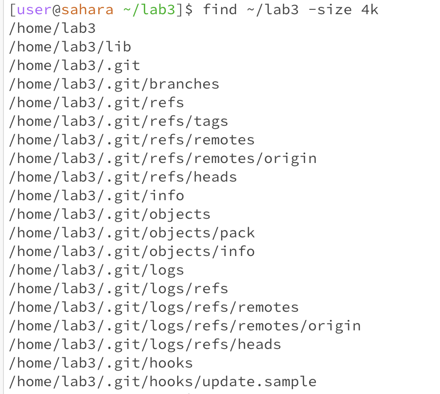

#Lab Report 3
**find command**
**Using -name**

*Using the command with "*java" indicates that the search that we are performing will be based on the file name(-name) and "*java" specifies that the file should end in "java". 
The asterisk * represents any sequence of characters, so it will accurately display all files ending with "java", no matter what the preceeding characters were. This example searches 
through the directory and gives a path to all files ending with "java"

*Using the command with a specific file name, "ArrayTest.java" will search the current directory for for a file with that exact name and return a path to that file. This is case sensitive
only files that match "ArrayTest.java" exactly will be counted as found. It will not return anything if the file is not found. 

**Using -type**

*Using "-type d" tells find to find all the directories in the specified starting directory, which in this case is home/lab3. It returns the paths of all directories within 
the lab3 folder/directory

*Using "-type f -empty" tells find to find all the files that are empty in the current directory(lab3). The "f" specifies to only look for regular files, not directories. Paths to all files
with no content are returned, in this case there were no empty files.

Source for above examples(-name and -type): https://www.redhat.com/sysadmin/linux-find-command 

**Using -size**

*This command searches the lab3 directory for files that are exactly 4 kilobytes in size.

*This command searches the lab3 directory for files that have size in range: larger than 1 kilobyte & smaller than 5 kilobytes

**Using -perm**
This deals with permissions, my source is this website, which explains how permissions work: https://www.grymoire.com/Unix/Permissions.html
They explain that read(4), write(2), execute(1) can all be used to intepret an octal representation of a permission.

**Example 1**
*"-perm 0644" format: (owner, group, others) indicates that the owner can read+write(4+2), the group and others can read only(4). This command outputs all files within the directory
with these specific permissions

**Example 2**
*"-perm -0200 -perm -0400" format: (owner, group, others) indicates that we need files with permissions that allow the owner to write(2) and read(4), however none of these are allowed 
for group or others. this command outputs all files within the directory that allow the owner to read and write, but does not allow that for others.

Source for the above examples (-perm and -size): https://linux.die.net/man/1/find

