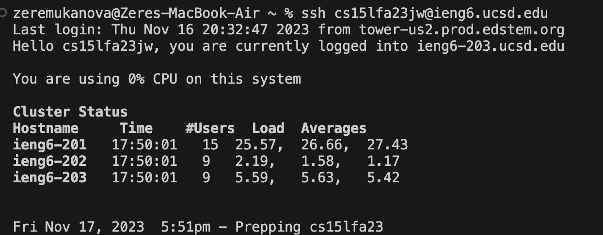
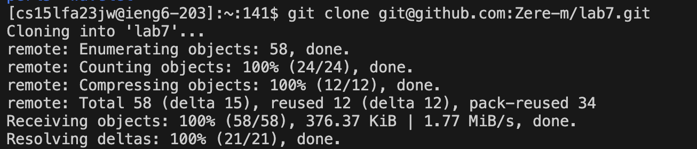
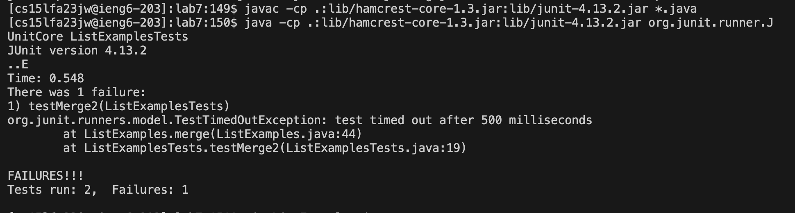
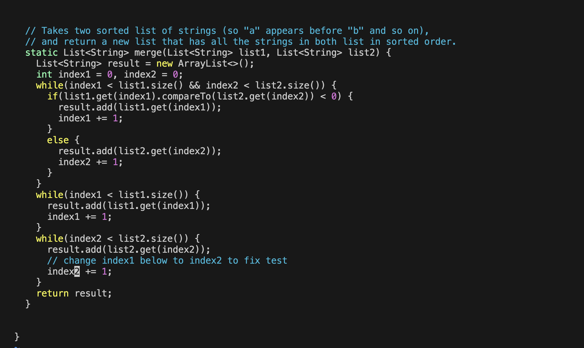
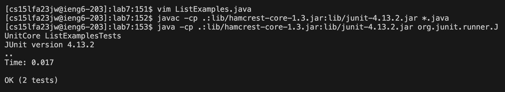
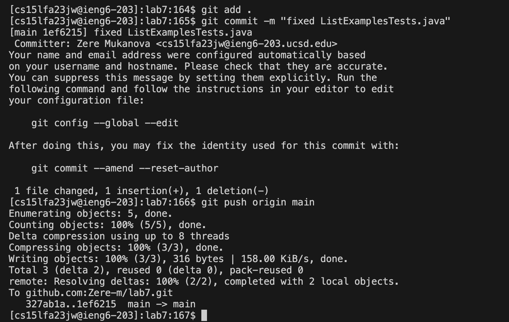

# Lab 4
**Step 4: Log into ieng6**
To log into ieng6, I typed `ssh cs15lfa23jw@ieng6.ucsd.edu`(exact command) which produced this outcome: 

The exact keys pressed were: `<s><s><h><space><c><s><1><5><l><f><a><2><3><j><w><shift><@><i><e><n><g><6><.><u><c><s><d><.><e><d><u><Enter>` 
This made sure I could login into my account. 
The effect of the keypresses was that I was able to login into my account and access directories under it 

**Step 5: Clone your fork of the repository from your Github account (using the SSH URL)**

To clone my fork of the repository, I first went to github and copied the SSH URL using "command-c" 
I then typed "git clone" into my terminal and pasted the URL using "command-v" 
The exact keys pressed in the terminal were: `<g><i><t><space><c><l><o><n><e><space><command-v><Enter>`
Summarized command: `git clone git@github.com:Zere-m/lab7.git` 
The effect of keystrokes: downloaded the forked repository and created a directory of lab7 in my ieng6 account 

**Step 6: Run the tests, demonstrating that they fail**

To run the tests, I first opened the test.sh file and copied the commands one by one 
Exact keys pressed to compile: `<c><a><t><space><t><e><s><t><.><s><h><Enter>` then I selected the first line in the file `<command-c><command-v><Enter>` 
Effect: this compiled the java files.  
Summarized commands: `cat test.sh` and `javac -c .:lib/hamcrest-core-1.3.jar:lib/junit-4.13.2.jar *. java` 

The effects of the key presses were: getting data from the cat command about test.sh/ outputting all of test.sh contents onto the screen + compiling java files. 
Exact keys pressed to run: `<c><a><t><space><t><e><s><t><.><s><h><Enter> `then I selected the second line in the file `<command-c><command-v><Enter>` 
Summarized commands: `cat test.sh` and `java -cp .:lib/hamcrest-core-1.3.jar:lib/junit-4.13.2.jar org.junit. runner.J
UnitCore ListExamplesTests` 
The effect of keypresses: getting data from the cat command about test.sh/ outputting all of test.sh contents onto the screen + run the tests and give an error as an output because ListExamples.java has not been modified yet 

**Step 7: Edit the code file to fix the failing test**

To edit the code file I opened it using vim and pressed the following keys:(43 down, 12 right, i, delete, 2, esc, :wq, enter)
`<down><down><down><down><down><down><down><down><down><down><down><down><down><down><down><down><down><down><down><down><down><down><down><down><down><down><down><down><down><down><down><down><down><down><down><down><down><down><down><down><down><down><down><right>`
`<right><right><right><right><right><right><right><right><right><right><right><i><delete><2><esc><:><w><q><Enter>` 
Summarized command: `vim ListExamples.java` 
The effects: opening file in vim for editing, navigating around the file, inserting new items into the file, :wq saved the changes made to ListExamples.java 

**Step 8: Run the tests, demonstrating that they now succeed**

To compile java files, I pressed the up arrow 3 times because it was in my history: `<up><up><up><Enter>` 
Summarized command: `javac -c .:lib/hamcrest-core-1.3.jar:lib/junit-4.13.2.jar *. java` 
To run the java files, I pressed the up arrow 3 times because it was in my history as well:`<up><up><up><Enter>` 
Summarized command: `java -cp .:lib/hamcrest-core-1.3.jar:lib/junit-4.13.2.jar org.junit. runner.J
UnitCore ListExamplesTests` 
The effects: Pressing the arrows allowed me to complete the process quickly, without having to type the commands again since they were in my history. The commands first compiles all java files, then ran ListExamplesTests to see the output after the file has been modified in step Step7 

**Step 9: Commit and push the resulting change to your Github account**

To stage all changes i used this command: `git add .` pressing the following keys: `<g><i><t><space><a><d><d><.><Enter>`  
The effect of this was adding a change in the working directory to the staging area. 
To add a commit message i used this command: `git commit -m "fixed ListExamplesTests.java"` pressing the following keys: `<g><i><t><space><c><o><m><m><i><t><space><-><m><"><f><i><x><e><d><space><L><i><s><t><E><x><a><m>
<l><e><s><T><e><s><t><s><.><j><a><v><a>` 
The effect of this was: captured a snapshot of the project's currently staged changes and added a commit message 
To push i used this command: `git push origin main` pressing keys: `<g><i><t><space>
<u><s><h><space><o><r><i><g><i><n><space><m><a><i><n><Enter>` which pushed the changes to github 

