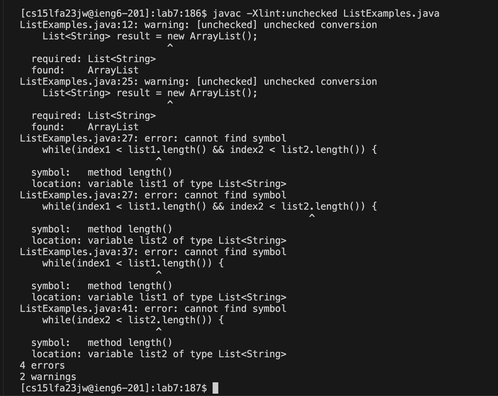

# Lab report 5 #
* The original post from a student with a screenshot showing a symptom and a description of a guess at the bug/some sense of what the failure-inducing input is. 
(Don’t actually make the post! Just write the content that would go in such a post) <br /> 

**Student's post**<br />
Hi there, I am running into some trouble with my lab7 code, ListExamples.java. It says that there is an unchecked conversion even though "result" is a list, and that the .length()
symbol cannot be found. I am using the .length() function to find how long our list is, and I'm making "result" an ArrayList because it's useful to create arrays. The message at 
the end gave me these messages : <br />
```
Note: ListExamples.java uses unchecked or unsafe operations.
Note: Recompile with -Xlint:unchecked for details.

```
which led me to recompile with -Xlint, I found out that the unchecked operation was an unchecked conversion.
I'm guessing there might be abother way to find how long the list is, but i'm not sure what that would be. As for the unchecked error, I've never gotten it before - it seems as if im properly initializing 
an ArrayList. Please let me know what direction I should go in to fix these bugs, thank you! <br /> 



* A response from a TA asking a leading question or suggesting a command to try (To be clear, you are mimicking a TA here.) <br /> 

**TA's response**<br />
Hello, it seems that you've mistaken the length() method for Strings and the size() method from the ArrayList class, that's what is causing the "cannot find symbol" error. The ArrayList class
uses size() to provide the number of objects, while length() provides the number of characters in a String object. These can get confused since we often thing of an array as 
having objects in a line, which can resemble different characters of a string. 
As for the unchecked conversion error, make sure to put `"<>"` when you are defining your list, these angle brackets specify the type of the objects in your list, check out generics in Java! This allows us to reuse 
the same code with different inputs, so the list can have objects of any type you specify: int, String, char, a class, etc. In this case, the angle brackets are a short hand for 
type inference, which basically says that your elements will be of String type. Please try modifying the lines in your code to something like this: `List<String> result = new ArrayList<>();`
<br /> 

* Another screenshot/terminal output showing what information the student got from trying that, and a clear description of what the bug is.

There were two bugs, one of them is not putting angle brackets when declaring my List result. Because we are using generics, and we specified the type of the List to be String
we needed to put the angle brackets to specify the type of the array as well. It is a better way to use generics and have a correct conversion.
Another bug was that I was mistakenly using the .length() method intended for strings, instead of the .size() method intended for ArrayLists. Because the ArrayList class
does not have a length() menthod, it was not able to find that symbol. <br />


* At the end, all the information needed about the setup including:<br />
The file & directory structure needed<br />
The contents of each file before fixing the bug<br />
The full command line (or lines) you ran to trigger the bug<br />
A description of what to edit to fix the bug <br /> 

**Directory and file structure:**<br />
lab7<br />
-ListExamples.class<br />
-ListExamples.java<br />
-ListExamplesTests.java<br />
-StringChecker.class<br />
-test.sh<br />
-lib<br />
    --hamcrest-core-1.3.jar<br />
    --junit-4.13.2.jar<br />

**Contents before fixing the bug**<br />

**ListExamples.class**
```����?C

java/lang/Object<init>()java/util/ArrayList


java/util/Lisiterator()Ljava/util/Iterator;

                                           java/util/IteratorhasNext()Z

                                                                      next()Ljava/lang/Object;ava/lang/String

StringChecker                          !
             checkString(Ljava/lang/String;)Z

                                             #
                                              $%add(ILjava/lang/Object;)V

  '
   ()size()I

            +
             ,-get(I)Ljava/lang/Object;
/
 01     compareTo(Ljava/lang/String;)I

                                      3
                                       $4(Ljava/lang/Object;)Z6
                                                               ListExamplesCodeLineNumberTablefilter1(Ljava/util/List;LStringChecker;)Ljava/utStackMapTable   SignatureY(Ljava/util/List<Ljava/lang/String;>;LStringChecker;)Ljava/util/List<Ljava/lang/String;>;merge2(Ljava/util/List;Ljava/util/List;)Ljava/util/List;n(Ljava/util/List<Ljava/lang/String;>;Ljava/util/List<Ljava/lang/String;>;)Ljava/util/List<Ljava/lang/String;>;
SourceFileListExamples.java 57*��9:7}<�Y�       M*�
N-��%-��:+��
            ,�"���,�8
#.7:;�
      '�<>?7��Y�        M>6*�&�X+�&�M*�*�+�*��.�,*�*��2W����,+�*��2W���NT!f"l%v&�'�)�*�,�.;�*��2W����,�8>
�F "<@AB[cs15lfa23jw@ieng6-201]:lab7:200$
```

**ListExamples.java**
```import java.util.ArrayList;
import java.util.List;

interface StringChecker { boolean checkString(String s); }

class ListExamples {

  // Returns a new list that has all the elements of the input list for which
  // the StringChecker returns true, and not the elements that return false, in
  // the same order they appeared in the input list;
  static List<String> filter(List<String> list, StringChecker sc) {
    List<String> result = new ArrayList();
    for(String s: list) {
      if(sc.checkString(s)) {
        result.add(0, s);
      }
    }
    return result;
  }


  // Takes two sorted list of strings (so "a" appears before "b" and so on),
  // and return a new list that has all the strings in both list in sorted order.
  static List<String> merge(List<String> list1, List<String> list2) {
    List<String> result = new ArrayList();
    int index1 = 0, index2 = 0;
    while(index1 < list1.length() && index2 < list2.length()) {
      if(list1.get(index1).compareTo(list2.get(index2)) < 0) {
        result.add(list1.get(index1));
        index1 += 1;
      }
      else {
        result.add(list2.get(index2));
        index2 += 1;
      }
    }
    while(index1 < list1.length()) {
      result.add(list1.get(index1));
      index1 += 1;
    }
    while(index2 < list2.length()) {
      result.add(list2.get(index2));
      // change index1 below to index2 to fix test
      index2 += 1;
    }
    return result;
  }


}
```
**ListExamplesTests.java**
```import static org.junit.Assert.*;
import org.junit.*;
import java.util.*;
import java.util.ArrayList;


public class ListExamplesTests {
        @Test(timeout = 500)
        public void testMerge1() {
                List<String> l1 = new ArrayList<String>(Arrays.asList("x", "y"));
                List<String> l2 = new ArrayList<String>(Arrays.asList("a", "b"));
                assertArrayEquals(new String[]{ "a", "b", "x", "y"}, ListExamples.merge(l1, l2).toArray());
        }

        @Test(timeout = 500)
        public void testMerge2() {
                List<String> l1 = new ArrayList<String>(Arrays.asList("a", "b", "c"));
                List<String> l2 = new ArrayList<String>(Arrays.asList("c", "d", "e"));
                assertArrayEquals(new String[]{ "a", "b", "c", "c", "d", "e" }, ListExamples.merge(l1, l2).toArray());
        }

}
```
**StringChecker.class**
```
StringCheckerjava/lang/Object
                             checkString(Ljava/lang/String;)Z
SourceFileListExamples.jav
```
**test.sh**
```
javac -cp .:lib/hamcrest-core-1.3.jar:lib/junit-4.13.2.jar *.java
java -cp .:lib/hamcrest-core-1.3.jar:lib/junit-4.13.2.jar org.junit.runner.JUnitCore ListExamplesTests
```
**Command lines to trigger the bug:**
To trigger the bug, I ran ```bash test.sh```

**What to fix**

To fix the bug, we need to edit the ListExamples.java file. Specifically: <br />
lines 12 and 25: add ```<>``` when declaring, after new ArrayList<br />
lines 27, 37, 41: change .length() to .size()

## Part2 ##

In the second half of the quarter, I learned how to edit files using vim which turned out
to be a very useful tool, even in personal use: to open, create, and edit files. The 
shortcuts that were taught to us were very useful as well, both for personal use
and programming assignments in other classes. Prior to this class, I did not know it was 
posssible to delete a large amount of lines or jump to the front of the command, whcih 
are useful commands to know.
Another thing I learned about is what a bash script is, as well as how auograders are 
setup to grade student submissions, it was very interesting to see how it works.
Finally, while not in the second half of the quarter, I learned how to navigate directories
and files using the command line and how to use github, two things that were unclear to 
me before. 
