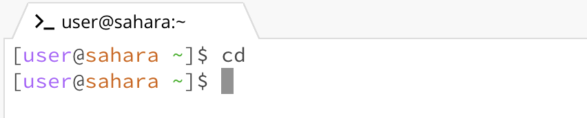
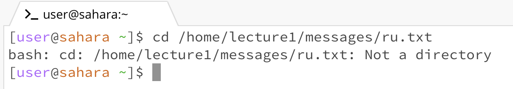
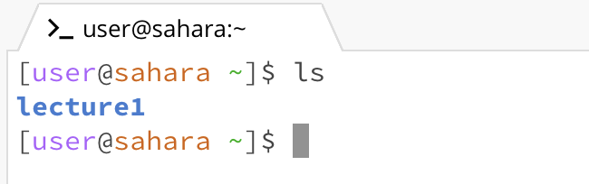
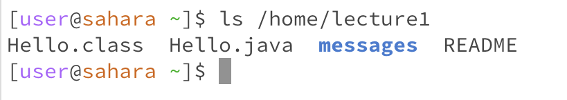
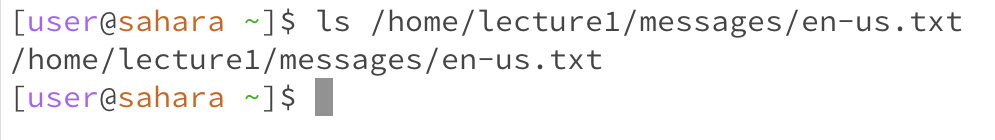
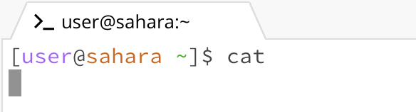
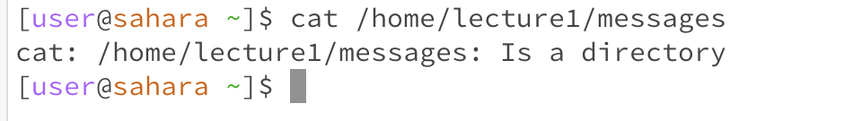
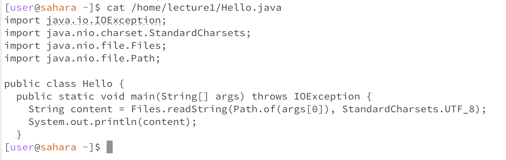

# Lab Report 1
**CD command:**

* The working directory was home when the command was run
* Running the cd command with no argument meant returning/ staying in the home directory since there is no argument passed to it stating what directory to change to
* The output is not an error, it simply does not do anything 

 
* The working directory was lecture 1 after the command was run, before it was /home
* Running the cd command with the absolute path to the lecture1 folder changed the directory to it because it was within the filesystem
* The output is not an error, the command switches the current directory 

 
* The working directory was home before and after the command was run
* Running the cd command with the absolute path to the en-us.txt file gave an error because it is not a directory
* The output is an error because the path provided was to a file, which does not contain files and folders within it, meaning it is not a directory

* The working directory was home before and after the command was run
* Running the command with no arguments meant listing the contents of the current directory which was home
* The output is not an error, it listed the folder under the current path (home) accurately

* The working directory was home before and after the command was run
* Runing the command with a path to a directory listed the contents of that directory because a proper path was provided
* The output is not an error, it listed the files and folders under the given path

* The working directory was home before and after the command was run
* Running the command with a path to a file listed/returning the path itself because it was not able to find any files or folders within the file
* In the case of the file path, the argument did not have files or folders in it, resulting in an error and a return of the path

* The working directory was home before and after the command was run
* Running the command with no arguments did not print anything, the terminal kept being paused until "Ctrl + D" was clicked because the cat command
was not finding the contents of the file that was supposed to be given
* The output is an error because it could not concatenate the contents of a file(), it was not given

* The working directory was home before and after the command was run
* Running the command with a path to a directory printed out a confirmation of it as a directory because it was not able to print contents of the directory as it is not a file
* The output is an error because a cat command expects to receive a file/ files not a path to a directory
  

* The working directory was home before and after the command was run
* Running the command with a path to a file printed out the contents of that file
* The output is not an error, contents of a file were printed as expected
