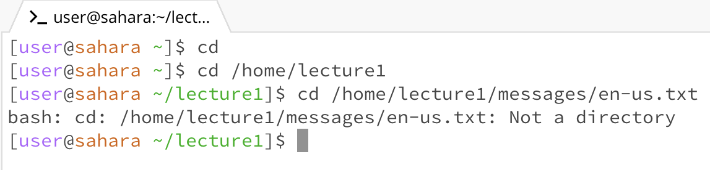

# Lab Report 1
CD command:

* The working directory was home at first when the command was run, later it was changed to lecture 1 (on line 2)
* Running the cd command with no argument meant returning/ staying in the home directory
* Running the cd command with the absolute path to the lecture1 folder changed the directory to it because it was within the filesystem
* Running the cd command with the absolute path to the en-us.txt file gave an error because it is not a directory
